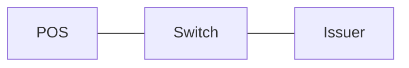

# pdf-sanitizer

A local-first **semantic PDF-to-Markdown extractor and sanitizer** for search, RAG, indexing, archival, migration, and human review.

It consolidates the useful PDF-processing ideas from [`pdf-tokenizer`](https://github.com/tahamoeini/pdf-tokenizer) and the ingestion path in [`article-writer`](https://github.com/tahamoeini/article-writer), then goes further in one deliberately narrow direction:

> **PDF in → faithful, deterministic, structure-aware Markdown out.**

This is not merely text extraction. The goal is to use the most appropriate Markdown representation for content that has real structure, while refusing to invent semantics for visuals that cannot be reconstructed safely.

## Semantic output contract

| PDF content | Output |
| --- | --- |
| Titles and headings | Markdown headings |
| Paragraphs | Markdown prose |
| Ordered/unordered lists | Markdown lists |
| Checkbox lists | GitHub task lists (`- [ ]`, `- [x]`) |
| Bold/italic and other layout-supported text | Markdown formatting when recoverable by the extraction engine |
| Monospaced/code regions | Fenced Markdown code blocks when detected |
| Links | Markdown links when recoverable from the PDF |
| Tables | GitHub-flavored Markdown tables |
| Text-based display equations | GitHub/MathJax LaTeX blocks (`$$ ... $$`) |
| Strong standalone equations left by OCR | Conservative LaTeX math blocks |
| Superscript/subscript/fractions | Preserved semantically; common math forms normalized to LaTeX in equations |
| Simple vector box/connector flows | Mermaid `flowchart` blocks |
| Embedded raster images | `[IMAGE_PLACEHOLDER ...]` |
| Complex/non-reconstructable vector graphics | `[GRAPHIC_PLACEHOLDER ...]` |
| Scanned text pages | OCR text when OCR is available/enabled |
| Headers/footers | Removed by default |
| Page boundaries | `<!-- page: N -->` comments by default |

The trust rule is simple:

1. **Native Markdown structure** when the PDF provides enough evidence.
2. **Deterministic reconstruction** for tables, equations, task lists, and simple flows.
3. **Faithful text preservation** when semantics are uncertain.
4. **Explicit placeholders** when the content is genuinely visual.

No summarization and no semantic guessing disguised as extraction.

## Why this supersedes the older extraction paths

`pdf-tokenizer` already had useful OCR fallback, image handling, source tracking, and heuristic diagram work, but it also carried GUI/export/tokenization concerns and often reduced visual content to OCR text or generic image reporting.

`article-writer` had a cleaner downstream ingestion philosophy, but its PDF path was primarily structured text extraction for indexing rather than a complete semantic PDF-to-Markdown representation.

`pdf-sanitizer` is the canonical preprocessing layer instead:

```text
PDF
 ↓
layout-aware extraction
 ↓
table recovery
 ↓
equation / math reconstruction
 ↓
task-list normalization
 ↓
vector-flow reconstruction
 ↓
visual classification + placeholders
 ↓
structure-safe sanitization
 ↓
Markdown
```

Chunking, embeddings, vector databases, article generation, and other downstream concerns should consume this Markdown rather than being coupled to PDF parsing.

## Installation

Python 3.10+:

```bash
python -m venv .venv
source .venv/bin/activate        # Windows: .venv\\Scripts\\activate
pip install -e .
```

For OCR, install Tesseract and the language packs you need. OCR is only used when enabled and useful; ordinary text PDFs do not need it.

> **Dependency licensing:** PyMuPDF and PyMuPDF4LLM have their own Artifex/AGPL/commercial licensing terms. Review those terms before choosing how you distribute a product that depends on them.

## CLI

```bash
pdf-sanitizer input.pdf
```

This writes `input.md` next to the PDF. Progress logs go to **stderr**, so `--stdout` remains safe for piping Markdown into another command.

Useful options:

```bash
pdf-sanitizer input.pdf -o clean.md
pdf-sanitizer input.pdf --stdout
pdf-sanitizer input.pdf --no-ocr
pdf-sanitizer input.pdf --ocr-language eng+fas
pdf-sanitizer input.pdf --force-ocr
pdf-sanitizer input.pdf --no-tables
pdf-sanitizer input.pdf --no-equations
pdf-sanitizer input.pdf --no-task-lists
pdf-sanitizer input.pdf --no-flows
pdf-sanitizer input.pdf --no-placeholders
pdf-sanitizer protected.pdf --password "..."
```

## Progress logging

Normal CLI runs show low-noise milestones plus coarse page progress. Use `-v` for every page and `-vv` for per-page semantic details such as detected tables, equations, flows, and visual placeholders.

```bash
# Normal progress on stderr
pdf-sanitizer input.pdf

# Every page
pdf-sanitizer input.pdf -v

# Every page plus semantic detection details
pdf-sanitizer input.pdf -vv

# Errors only on the console
pdf-sanitizer input.pdf --quiet

# Persist every progress event to a text log
pdf-sanitizer input.pdf --log-file extraction.log

# Machine-readable JSON Lines progress
pdf-sanitizer input.pdf --log-file extraction.jsonl --log-format json
```

Progress stages include input validation, engine loading, PDF opening, layout/OCR extraction start and completion, per-page semantic processing, page-level safe fallbacks, final completion, and failures.

A page event can include data such as:

```json
{
  "stage": "page",
  "current": 12,
  "total": 40,
  "percent": 30.0,
  "page": 12,
  "elapsed_seconds": 0.18,
  "details": {
    "tables": 1,
    "equations": 2,
    "flows": 0,
    "visual_placeholders": 1,
    "output_chars": 3842
  }
}
```

Persistent log files receive **all** progress events even when console output is coarsened or `--quiet` is used.

## Python API

```python
from pdf_sanitizer import ExtractionConfig, extract_pdf

result = extract_pdf(
    "input.pdf",
    config=ExtractionConfig(
        use_ocr=True,
        ocr_language="eng+fas",
        extract_tables=True,
        extract_equations=True,
        normalize_task_lists=True,
        detect_vector_flows=True,
        include_page_markers=True,
    ),
)

print(result.markdown)
```

Library callers can consume typed progress events directly instead of scraping log text:

```python
from pdf_sanitizer import ProgressEvent, extract_pdf


def on_progress(event: ProgressEvent) -> None:
    if event.percent is not None:
        print(f"{event.stage}: {event.percent:.0f}%")
    else:
        print(f"{event.stage}: {event.message}")


result = extract_pdf("input.pdf", progress=on_progress)
```

The progress callback contains no PDF text content. It reports operational metadata and counts, leaving telemetry/storage policy under the caller's control.

## Example output

````markdown
<!-- page: 1 -->

# Payment Model

The terminal sends the transaction request to the switch.

| Field | Meaning |
| --- | --- |
| STAN | System trace audit number |
| RRN | Retrieval reference number |

$$
P_{success} = 1 - P_{timeout}
$$

- [x] Validate request
- [ ] Complete settlement



[IMAGE_PLACEHOLDER page=1 bbox="72,420,540,690"]
````

## Equation handling

GitHub Markdown supports LaTeX math, so mathematical content should not be flattened into ordinary prose when the PDF provides enough evidence.

The extractor uses two conservative paths:

- **Native text equations:** span-level text, math symbols, font hints, and superscript information are used to identify likely display equations and reconstruct common Unicode math as LaTeX.
- **OCR/layout fallback:** a stricter standalone-line detector catches obvious equations such as `x = y + 2` when span-level structure is unavailable.

Common Greek symbols, relations, operators, fractions, superscripts, and subscripts are normalized where doing so is deterministic.

Inline prose is deliberately not aggressively rewritten into `$...$`. A false equation is worse than preserved plain text.

Image-only or highly graphical formulas are not hallucinated into LaTeX. They remain visual placeholders unless a future deterministic/local formula-recognition backend is added.

## Structure-safe sanitization

Sanitization is structural, not editorial. It:

- uses Unicode **NFC**, not compatibility normalization that can destroy superscripts, subscripts, or fractions;
- normalizes ligatures, line endings, zero-width/control characters, and extraction noise;
- repairs obvious Latin prose line-wrap hyphenation;
- protects fenced code, Mermaid, and other literal blocks from prose cleanup;
- suppresses generated image links/binaries in favor of deterministic visual placeholders;
- removes detected headers and footers by default;
- avoids duplicate table/equation/diagram text when replacing a detected region;
- preserves the actual claims and wording of the PDF rather than summarizing or rewriting them.

It does **not** remove text because it looks like an instruction, prompt injection, opinion, or unwanted claim. Content filtering is a separate concern from faithful extraction.

## Tables

Tables are extracted through PyMuPDF table detection and emitted as GitHub-flavored Markdown. The extractor uses multiple table strategies, including a layout-independent fallback for ruled tables that newer layout analysis may classify as pictures.

A final word-position fallback handles simple ruled tables when the primary table detector still fails.

Complex merged-cell tables may necessarily lose rowspan/colspan semantics because GitHub-flavored Markdown tables do not represent those features directly. The tool prefers faithful cell text over fabricated structure.

## Flows and vector graphics

Simple vector diagrams are reconstructed only when the page contains multiple labeled rectangle nodes and actual connector-line evidence. The result is Mermaid.

Connector direction is not invented. Until arrowhead direction can be established reliably, reconstructed links use Mermaid's undirected `---` edge.

Everything more ambiguous stays a `[GRAPHIC_PLACEHOLDER ...]`.

## Images and scans

Raster images are not OCR-summarized into fake prose. They become deterministic placeholders containing page and bounding-box coordinates.

Full-page scanned documents are treated differently: when OCR supplies meaningful page text, that text is preserved rather than replacing the entire page with one image placeholder.

## What is preserved but not over-inferred

Some PDF semantics are inherently ambiguous because PDF stores visual placement more reliably than logical document structure. The extractor therefore preserves content without pretending certainty for cases such as:

- inline mathematical fragments embedded deeply in prose;
- footnotes whose reference/definition relationship is not structurally recoverable;
- arbitrary UML/BPMN/network/architecture diagrams;
- charts whose data values are encoded only graphically;
- merged/irregular tables whose cell spanning cannot be represented faithfully in GFM;
- rasterized equations without a dedicated formula-recognition backend.

These are explicit boundaries, not forgotten features.

## Safety and operational limits

- No network calls or external AI APIs.
- Does not execute PDF JavaScript, attachments, links, or embedded files.
- Progress events do not contain extracted PDF text; only stages, counts, timing, paths, and error metadata.
- Default input limit: 512 MB.
- Default page limit: 2,000 pages.
- Password-protected PDFs require an explicit password.
- `--strict` turns page-level graceful fallback into fail-fast behavior.

## Development

```bash
pip install -e ".[dev]"
ruff check src tests
pytest
```

Regression coverage includes sanitization, semantic math conversion, task lists, table extraction, vector-flow reconstruction, progress reporting, and generated end-to-end PDFs.

CI runs linting and tests on every push and pull request.

## Project boundary

This repository is the **canonical PDF extractor/sanitizer**.

It is not a tokenizer, chunker, vector database, RAG pipeline, article writer, GUI, or PDF editor. Those can consume its Markdown output.

Keeping PDF interpretation in one well-tested layer is substantially less absurd than maintaining slightly different PDF parsers inside every downstream project.
