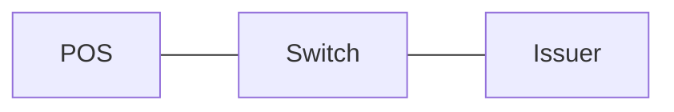

# pdf-sanitizer

A local-first PDF content extractor that returns **clean, deterministic Markdown** for downstream search, RAG, indexing, archival, or human review.

It consolidates the useful ideas from [`pdf-tokenizer`](https://github.com/tahamoeini/pdf-tokenizer) and the document-ingestion path in [`article-writer`](https://github.com/tahamoeini/article-writer), while narrowing the contract to one thing: **PDF in, sanitized Markdown out.**

## Output contract

`pdf-sanitizer` tries to preserve meaning without pretending it understands visual content that cannot be reconstructed safely.

| PDF content | Markdown output |
| --- | --- |
| Titles, headings, paragraphs, lists, code | Markdown text and structure |
| Tables | GitHub-flavored Markdown tables |
| Simple vector box/connector flows | Mermaid `flowchart` blocks |
| Embedded raster images | `[IMAGE_PLACEHOLDER ...]` |
| Non-reconstructable vector graphics | `[GRAPHIC_PLACEHOLDER ...]` |
| Scanned text pages | OCR text when OCR is available/enabled |
| Headers/footers | Removed by default |
| Page boundaries | `<!-- page: N -->` comments by default |

The extractor is deliberately conservative. If a vector diagram cannot be reconstructed with enough evidence, it becomes a placeholder instead of fabricated Mermaid semantics.

## Why this design

The older `pdf-tokenizer` already contains useful OCR fallback, source tracking, image handling, and heuristic diagram work. `article-writer` has the cleaner downstream assumption: extracted documents should become structured, normalized source material rather than a pile of image artifacts and auxiliary JSON. This project combines those lessons and removes the rest.

The implementation uses PyMuPDF/PyMuPDF4LLM for layout-aware Markdown, table handling, multi-column reading order, and optional OCR. A second conservative pass corrects/normalizes tables, identifies simple vector flows, replaces visuals with deterministic placeholders, and sanitizes Unicode/layout noise.

## Installation

Python 3.10+:

```bash
python -m venv .venv
source .venv/bin/activate        # Windows: .venv\\Scripts\\activate
pip install -e .
```

For OCR, install Tesseract and the language packs you need. OCR is only used when enabled and useful; ordinary text PDFs do not need it.

> **Dependency licensing:** PyMuPDF and PyMuPDF4LLM have their own Artifex/AGPL/commercial licensing terms. Review those terms before choosing how you distribute a product that depends on them.

## CLI

```bash
pdf-sanitizer input.pdf
```

This writes `input.md` next to the PDF.

Useful options:

```bash
pdf-sanitizer input.pdf -o clean.md
pdf-sanitizer input.pdf --stdout
pdf-sanitizer input.pdf --no-ocr
pdf-sanitizer input.pdf --ocr-language eng+fas
pdf-sanitizer input.pdf --force-ocr
pdf-sanitizer input.pdf --no-flows
pdf-sanitizer input.pdf --no-placeholders
pdf-sanitizer protected.pdf --password "..."
```

## Python API

```python
from pdf_sanitizer import ExtractionConfig, extract_pdf

result = extract_pdf(
    "input.pdf",
    config=ExtractionConfig(
        use_ocr=True,
        ocr_language="eng+fas",
        include_page_markers=True,
    ),
)

print(result.markdown)
```

## Example output

````markdown
<!-- page: 1 -->

# Payment Flow

The terminal sends the transaction request to the switch.

| Field | Meaning |
| --- | --- |
| STAN | System trace audit number |
| RRN | Retrieval reference number |



[IMAGE_PLACEHOLDER page=1 bbox="72,420,540,690"]
````

## Sanitization rules

The sanitizer is intentionally structural, not editorial. It:

- normalizes Unicode (NFKC), ligatures, line endings, and zero-width/control characters;
- repairs obvious Latin word-wrap hyphenation;
- suppresses generated image links/binaries in favor of placeholders;
- removes detected headers and footers by default;
- avoids duplicate table/diagram text when replacing a detected region;
- preserves the actual textual claims of the PDF rather than summarizing or rewriting them.

It does **not** remove text because it looks like an instruction, opinion, prompt injection, or unwanted claim. Content filtering is a separate concern from faithful document extraction.

## Visual handling

### Tables

Tables are extracted through PyMuPDF table detection and emitted as GitHub-flavored Markdown. If PyMuPDF4LLM has already produced a valid Markdown table, the sanitizer leaves it alone.

### Flows and shapes

Simple vector diagrams are reconstructed only when the page contains multiple labeled rectangle nodes and actual connector line evidence. The result is Mermaid. Connector direction is intentionally not invented; reconstructed connections use Mermaid's undirected `---` edge unless the source provides stronger semantics in future versions.

### Images and complex graphics

Raster images and ambiguous/complex vector graphics are not OCR-summarized into fake prose. They become deterministic placeholders containing page and bounding-box coordinates. Full-page scans are the exception: if the page has little native text and OCR produced meaningful text, the OCR content is preserved.

## Safety and operational limits

- No network calls or external AI APIs.
- Does not execute PDF JavaScript, attachments, links, or embedded files.
- Default input limit: 512 MB.
- Default page limit: 2,000 pages.
- Password-protected PDFs require an explicit password.
- `--strict` turns page-level graceful fallback into fail-fast behavior.

## Development

```bash
pip install -e ".[dev]"
ruff check src tests
pytest
```

CI runs linting and tests on every push and pull request.

## Scope

This repository is the canonical extractor/sanitizer. It is not a tokenizer, chunker, vector database, RAG pipeline, article writer, OCR workbench, GUI, or PDF editor. Those can consume its Markdown output. Keeping that boundary sharp is the whole point.
