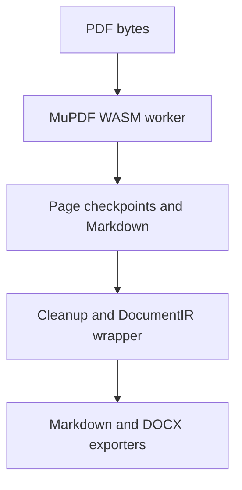
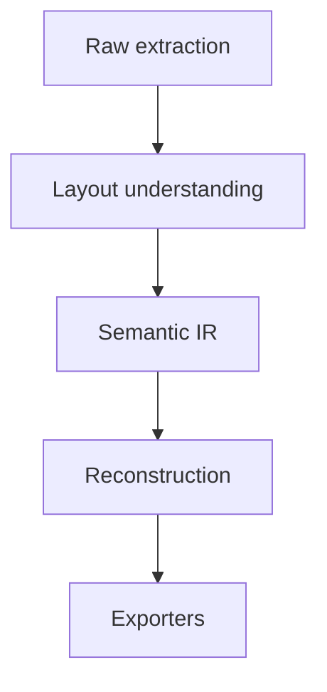

> Historical record from the September 2026 upgrade. This file is archived for context and is not an active backlog or current implementation guidance. See [the active roadmap](../../roadmap.md).

# GlyphMend extraction and reconstruction roadmap

Status: architecture/audit record updated with the conservative TableIR and evidence-driven EquationIR implementation slices. This document does not claim improved extraction quality; no independent real-PDF corpus measurement has been run.

Audit baseline:

- Repository: `tahamoeini/glyph-mend`
- Latest `main` inspected: `90307d5d6846996741ede1d969482e4cbbc2f60d` (merge of PR #42)
- PR #35 merge inspected: `305a59b`
- PR #35 head inspected: `565f1ea`
- Audit date: 2026-09-19

This document separates repository facts from inferences and recommendations. A fact is directly visible in the current source, test, fixture, workflow, or manifest. A hypothesis is a likely explanation that still needs a corpus or runtime measurement. An unknown is deliberately not inferred from the repository.

## 1. Executive map

GlyphMend currently has two extraction families:

1. The browser application uses MuPDF WASM in a dedicated worker, stores per-page checkpoints in IndexedDB, reconstructs page Markdown, and exports Markdown or DOCX from that Markdown.
2. The Python edition uses PyMuPDF4LLM/PyMuPDF, disk checkpoints, Python rendering/overlay logic, and a separate Markdown-first DOCX exporter.

They share concepts and some contract names, but they do not currently share one executable extraction IR or one layout/reconstruction implementation. The browser `DocumentIR` is real as a validation and metadata boundary, but its current Markdown serializer primarily concatenates block Markdown. It is not yet the canonical source consumed by both exporters.

The current browser flow is:

The intended architecture is:

The migration is therefore not “improve Markdown heuristics” in isolation. It is to preserve raw evidence, make layout decisions explicit, make semantic relationships canonical, and make reconstruction/export consume that canonical representation.

## 2. Current architecture and data flow

### Browser application

| Stage | Current location | What it does | Important boundary |
|---|---|---|---|
| File/open state | `web-app/src/app.js`, `web-app/src/storage/` | Reads the full PDF into browser memory, stores workspace metadata and PDF bytes, prepares PDF.js preview | The full source PDF is retained, but extraction workers receive a copied full buffer per batch |
| Batch orchestration | `web-app/src/app.js` (`runBatch`, `extract`, `stop`) | Selects pages, skips completed checkpoints, retries a failed batch once, persists page results | Worker cancellation is termination-based; there is no cooperative extraction cancel message |
| Extraction runtime | `web-app/src/features/extraction/extract-worker.js` | Opens MuPDF document, extracts structured text, images, vectors, tables, equations, and OCR results | Most source objects are reduced to page blocks, bboxes, flags, text, or rendered PNG crops |
| MuPDF integration | `web-app/src/mupdf-vite.js`, `web-app/src/features/extraction/` | Copies MuPDF JS/WASM assets into the Vite build and installs structured-text recovery/fidelity helpers | The exact fidelity of every MuPDF callback is not captured in a durable raw layer |
| Raw text/layout preparation | `structured-lines.js`, `layout-layer.js`, `extract-worker.js` | Collects block/line/character callbacks, retains per-character bbox/baseline/font references, and derives deterministic line/block candidates | The MuPDF structured tree and complete image/path payloads are still not a durable raw evidence record |
| Reading order | `layout-layer.js`, `extract-worker.js` | Uses page-derived gutter evidence, full-width anchors, column-local geometry, direction evidence, and ambiguity diagnostics | Current implementation is a conservative two-column candidate layer; N-column regions, sidebars, footnotes, and document-level order remain incomplete |
| OCR | `ocr.js`, `ocr-layout.js`, `security-boundaries.js` | Uses local Tesseract WASM and bundled English data; renders full pages and orders OCR lines | Triggering is low-text/replacement-character based; OCR output has limited structural provenance |
| Page reconstruction | `layout-layer.js`, `document-ir.js`, worker Markdown helpers | Emits ordered layout candidates with heading/list/caption/footnote/equation hypotheses and provenance before the legacy Markdown compatibility path | Tables, figures, and OCR still have parallel producers; full document reconstruction and exporter-native semantics remain incomplete |
| Table evidence/reconstruction | `shared/table-ir.js`, `extract-worker.js`, `document-ir.js` | Validates versioned table/cell/row/column evidence, confidence dimensions, source references, detected rules/alignment, and conservative Markdown/HTML/source-crop dispositions | Worker-side span reconstruction, document-level multipage stitching, and native DOCX TableIR mapping remain incomplete |
| Persistence | `web-app/src/storage/`, `app.js` | Stores page checkpoints, quality, assets, edges, review items, engine, and document IR | Durable checkpoints are page-scoped; document-level relationships are rebuilt later |
| Cleanup | `cleanup.js` | Normalizes Unicode/whitespace, removes or merges running matter, joins some page paragraphs, repairs Markdown artifacts | Cleanup can delete or rewrite text without retaining a reversible decision trace |
| Quality/review | `quality-report.js`, `quality-audit.js`, worker quality fields | Reports text/object counts, heuristic confidences, OCR/fallback indicators, and review items | `suspiciousGaps` is currently hard-coded to zero in the worker; structural correctness is not measured against ground truth |
| Markdown preview/export | `web-app/src/features/export/`, `document-ir.js` | Serializes page/block Markdown, renders preview with Marked/DOMPurify | The current IR-to-Markdown path mostly concatenates `block.markdown`; relationships and many typed fields do not drive output |
| DOCX export | `docx-export.js`, `streaming-docx.js`, `visual-docx.js` | Parses Markdown into paragraphs, tables, lists, equations, and source-visual images; has a streaming OOXML path | It reparses Markdown, supports only a subset of list/table/visual semantics, and does not receive the full IR provenance model |
| Source preview | `app.js`, PDF.js | Renders selected source pages to canvas | There is no source-region overlay or block-to-source alignment view |

### Python edition

| Stage | Current location | What it does | Important boundary |
|---|---|---|---|
| Extraction | `src/pdf_sanitizer/pipeline.py`, `src/pdf_sanitizer/extractor.py` | Uses PyMuPDF4LLM and native PyMuPDF fallbacks; supports page batches and OCR options | This is a separate implementation from the browser worker |
| Checkpointing | `src/pdf_sanitizer/workflow.py` | Writes Markdown parts and page checkpoints to disk and can reuse completed work | The persisted unit is Markdown-oriented, not the browser `DocumentIR` |
| Semantic overlays | `src/pdf_sanitizer/renderer.py`, `extractor.py` | Injects tables, equations, vector diagrams, images, and placeholders into page Markdown | Overlay logic is duplicated across Python modules and is not shared with browser logic |
| DOCX | `src/pdf_sanitizer/docx_export.py`, `word_math.py` | Parses Markdown and optionally crops source regions for placeholders; supports native Word math | It has a different Markdown parser and different reconstruction behavior from browser DOCX |

### Semantic Document IR v2 implemented on this branch

The branch adds `web-app/src/shared/semantic-document-ir.js` plus the companion declaration file `semantic-document-ir.d.ts`. This is the central v2 contract, not a replacement of the legacy page/block object in one step.

- `semanticDocumentFromLegacyDocumentIR` is the compatibility adapter from the existing `documentIR.js` shape.
- `createSemanticDocumentIR`, `validateSemanticDocumentIR`, deterministic serialization/deserialization, and comparison form the runtime boundary for worker/external data.
- Nodes carry typed content/children, deterministic IDs, source page, normalized bbox, coordinate space, source kind and span/object/crop references, separate extraction/structure/reconstruction/export confidence, disposition, reconstruction version, and diagnostics.
- `extract-worker.js` emits v2 alongside the existing `documentIR`; `app.js` validates the v2 payload before checkpointing it. The legacy payload remains available for current cleanup and resume behavior.
- `document-ir.js` routes its existing Markdown function through the v2 adapter without changing its public API or expected Markdown output.
- `docx-export.js` exposes `semanticDocumentToDocx`; it currently adapts v2 to the existing Markdown-first DOCX writers. Native IR-to-OOXML mapping remains future work.
- `qualityAudit` includes a separate v2 quality/provenance report. Reconstructable bundles include `semantic-document-ir.json`; ordinary Markdown/DOCX files remain compatible and visible output is not polluted with internal metadata.

This is intentionally a contract migration, not a claim that layout recognition, table reconstruction, equation correctness, or figure editability are solved.

### Deterministic layout layer implemented on this branch

`web-app/src/features/extraction/layout-layer.js` is now the browser page-layout seam. It consumes normalized MuPDF block/line/character evidence and page objects, and produces ordered candidates without cloud services or a replacement PDF engine. The worker uses it for page ordering, heading levels, and candidate provenance while retaining the existing OCR, table, equation, source-crop, batching, resume, and cancellation paths.

The layer derives thresholds from each page's observed line heights, body-size distribution, margins, and x-start intervals. It records source page/bbox, source block/span/object IDs, structure confidence, and diagnostics for ambiguous column splits, mixed heading signals, equation-like text, and merged paragraph continuations. It deliberately leaves unresolved candidates in the stream rather than silently reordering them.

The committed fixtures are synthetic regression evidence for a hierarchical contents page, a two-column academic page, ambiguous gutter evidence, span/paragraph grouping, and repeated running matter. They prove deterministic behavior and metric plumbing; they do not establish real-PDF accuracy. Real corpus measurements remain an explicit open item.

### Conservative TableIR implementation slice on this branch

The browser table producers now converge on `web-app/src/shared/table-ir.js` and its declaration file. `tableIRFromRows` adapts the existing block, vector-rule, and OCR table paths without changing their batch/resume/cancel orchestration. `detectTableIR` is a deterministic geometry adapter for raw lines/chars and vector rules; it does not fill an unobserved grid position. Every canonical table carries ordered rows/columns/cells, cell/table bboxes, source IDs, detected rules, alignment evidence, separate detection/structure/content/export confidence, disposition, reconstruction version, and unresolved-cell diagnostics.

The legacy `DocumentIR` shape remains available. Its adapter preserves the old scalar `confidence` and row/column fields for current consumers while retaining the canonical TableIR fields. Semantic Document IR v2 validates a canonical table at its external-data boundary. Current Markdown export is gated by rectangular, non-spanning, sufficiently high-structure-confidence tables. Empty cells are unresolved unless the source explicitly marks them as observed; no value is inserted. Non-representable page tables use a bounded source crop when rendering is available, and the crop ID is added to table provenance. DOCX remains the existing Markdown-first compatibility path; native Word TableIR mapping is not claimed here.

The committed table fixtures cover bordered digital, borderless, merged-header, financial, scientific, page-split, and malformed/partially scanned evidence. They prove schema behavior, deterministic serialization, confidence gating, and source fallback decisions. They do not establish cell accuracy on a real-PDF corpus. Multi-page stitching, reliable worker-side span reconstruction, and independent corpus measurements remain open.

### Evidence-driven EquationIR and editable equation slice

The browser equation path now wraps the existing bounded structural MathIR parser in `web-app/src/shared/equation-ir.js`. EquationIR v1 carries explicit `inline`/`display` mode, deterministic ID, page/bbox/coordinate space, source span/region/object/crop references, separate detection/recognition/structure/validation/reconstruction/export confidence, disposition, reconstruction version, and diagnostics. `parseEquationIR` and `serializeEquationIR` are runtime validation and deterministic serialization boundaries; raw source evidence is not mutated.

The worker retains source crop assets for successful and fallback equation candidates, attaches EquationIR to legacy page entries and Semantic Document IR content, and records per-dimension page quality. Inline candidates remain conservative: explicit TeX delimiters and high-signal relation expressions are represented as inline EquationIR while surrounding prose remains unchanged. Text-native display candidates use existing geometry/provider evidence and the bounded parser; raster/image candidates use local OCR only when a nearby formula cue exists. Unsupported commands, missing operands, and low-confidence candidates remain `needs-review` or `preserved-source`.

Markdown uses editable LaTeX only for validated reconstructed dispositions. The browser DOCX exporter retains its existing Markdown compatibility path and also exposes a direct `equationIRParagraph` adapter that emits native OMML for the validated MathIR subset and returns a source-visual/text fallback otherwise. The streaming DOCX path still consumes Markdown and is not yet a direct EquationIR writer. Source crop references remain available after successful reconstruction.

This slice does not establish equation correctness. The structural comparator has a self-comparison fallback for diagnostics, but the editable gate requires independent expected evidence or the conservative structured-text path; OCR without independent evidence remains review/source-preserved. Parser acceptance therefore means “structurally parseable,” not “mathematically verified.” No mandatory large model or cloud recognition service was added. A local-only recognizer remains optional and must sit behind the same candidate/MathIR contract if evaluated.

### Runtime and delivery constraints observed in the repository

- The browser app is offline/local-first: MuPDF, PDF.js, Tesseract worker/core/data, and other assets are copied into the Vite build; no upload path is present in the extraction flow.
- `web-app/package.json` uses `mupdf`, `pdfjs-dist`, `tesseract.js`, `docx`, `fflate`, `idb`, `marked`, and `dompurify`. `node_modules` was not present in the audited checkout, so the browser test suite was not executed during this audit.
- The UI defaults to a 512 MB file limit and 2,000-page limit. Batch size is configurable and capped at 100 pages. These are UI/runtime safeguards, not measured extraction-quality limits.
- Vite copies the MuPDF/PDF.js/Tesseract assets. Workbox has a 20 MB maximum cache-entry setting. The worker crop path caps rendered crops at 40,000,000 pixels and 32 MB PNG output; other page/asset limits are enforced in shared safety contracts.
- The final DOCX is a browser `Blob`, even when the OOXML body is streamed into a ZIP writer. This bounds some intermediate strings but does not make the entire result stream to disk.

## 3. Information-loss ledger

The following are observed limitations or code-level loss points. “Hypothesis” identifies a likely root cause that needs corpus measurement before it is treated as a confirmed quality result. No item below claims that extraction quality improved.

| ID | Observed behavior | Likely root cause | Affected module/file | Evidence or fixture | Recommended change | Blocks later work? |
|---|---|---|---|---|---|---|
| LOSS-01 | Every extraction batch sends a copy of the full PDF buffer to a new worker; MuPDF opens the full document for that batch. | Batch isolation was favored over a long-lived document handle. This can multiply memory and startup cost for large PDFs. **Hypothesis:** peak memory and latency will be material on large files. | `web-app/src/app.js` (`runBatch`), `extract-worker.js` | Worker request contains `state.pdfBytes.slice(0)`; UI batch cap and file/page caps. No large-file profile is committed. | Measure peak heap/startup cost; consider a controlled long-lived worker/document handle or a bounded source abstraction while retaining retry isolation. | Yes for large-file performance claims; no for semantic design. |
| LOSS-02 | Before this branch, text was normally ordered by y then x with one stable two-column signature. | The old `orderPageEntries` path had one pivot heuristic, not a region/reading-order graph. | `extract-worker.js`; now `layout-layer.js` | New synthetic tests cover stable two-column order, full-width anchors, sparse sidebars, RTL direction, and ambiguous gutters. No real-PDF accuracy claim is made. | Extend the deterministic candidate layer with independently labeled region graphs, sidebars, footnotes, and document-level order evidence. | Yes for reliable structural reconstruction. |
| LOSS-03 | Paragraphs are not yet represented by a durable document-scope line/spacing/indent model; cleanup still joins a narrow class of cross-page continuations. | The new layer retains line bbox/baseline/font evidence and can conservatively merge visual continuations, but legacy blocks still become Markdown entries before full reconstruction. | `layout-layer.js`, `extract-worker.js`, `cleanup.js` | `groupSpansIntoLines`, `groupLinesIntoBlocks`, and merge diagnostics have synthetic tests; `joinPageParagraphs` remains in cleanup. | Make paragraph candidates and cross-page continuation decisions first-class IR records with reversible diagnostics. | Yes for paragraph and list fidelity. |
| LOSS-04 | Heading hierarchy remains heuristic, although it now combines numbering, style, relative size, whitespace, alignment, and context. | The new page layer emits a heading level only when combined evidence crosses a conservative score; document-level section reconciliation and independent accuracy labels are absent. | `layout-layer.js`, `extract-worker.js`, `cleanup.js`, `document-ir.js` | Hierarchical TOC fixture tests 1/1.1/2 levels; no real-PDF heading ground truth. | Add document-level hierarchy reconciliation and independent heading annotations; keep mixed cases as low-confidence candidates. | Yes for navigation and semantic export. |
| LOSS-05 | Native list structure, nesting, continuation paragraphs, and list-item provenance are not strongly retained. | Lists are mostly recognized from Markdown markers or OCR text after ordering. | `extract-worker.js`, `document-ir.js`, `docx-export.js`, `streaming-docx.js` | `DocumentIR` has a list block type, but exporters parse line prefixes; browser tests are hand-authored IR fixtures. | Represent list/list-item nodes with nesting, marker, continuation, bbox, and source IDs; export from those nodes. | Yes for faithful list output. |
| LOSS-06 | Captions are generally stored as a string on a visual asset; they are not consistently emitted as separate caption blocks with stable source relationships. | Caption association occurs as a nearby-text heuristic rather than a first-class layout decision. | `extract-worker.js` (`captionFor`), `document-ir.js` | `pageDocumentIR` can link nearby captions, but worker visual entries primarily carry `caption`; no caption extraction fixture is committed. | Create explicit caption nodes and `describes` relationships, retaining candidate/rejected associations. | Yes for figure/table semantics. |
| LOSS-07 | Header/footer removal can delete repeated edge text, but current worker edge records are mostly strings and do not retain full geometry/font evidence. | Running-matter classification is applied after page Markdown/IR creation; edge metadata is not a rich raw layer. | `extract-worker.js`, `cleanup.js` | Worker captures top/bottom bands; `classifyRunningMatter` and `applyRunningMatterToDocumentIR` can REMOVE/MERGE text; no labeled header/footer corpus. | Preserve edge candidates with page, bbox, text, font, repetition signature, and decision; make removal reversible in the audit trail. | Yes for safe running-matter cleanup. |
| LOSS-08 | Vector tables still reject merged/span rows in the worker, and the old producers previously exposed only raw rows/Markdown to downstream consumers. The new TableIR path now retains cell/bbox/source/confidence evidence, but unsupported structures are deliberately preserved rather than flattened. | Detection is still split among rule-grid, block-start, text-gap, and OCR heuristics; the contract exists, but worker-side span reconstruction and multi-page stitching are not implemented. | `extract-worker.js` (`pageTableFromVectors`, `pageTableFromBlocks`, `ocrTableModel`), `shared/table-ir.js`, `document-ir.js` | `table-ir.test.js` covers bordered/borderless/merged/malformed cases; existing vector regression still expects a merged row to be rejected. No real-PDF cell benchmark exists. | Add independent cell annotations, worker-side evidence-backed span candidates, multipage identity/stitching, and calibrated cell/text/span metrics. Keep source crop fallback for unresolved tables. | Yes for reliable table editing and native DOCX tables. |
| LOSS-18 | A structured table with spanning or unresolved/unknown empty cells cannot be represented as a Markdown grid without loss. | Markdown has no native span model and a blank source position cannot distinguish an intentional empty cell from unreadable/missing evidence. | `shared/table-ir.js`, `extract-worker.js` | Merged-header and empty-cell tests require HTML/source fallback; no fabricated placeholder is emitted by the TableIR adapter. | Keep explicit structured HTML/source-crop fallback, add a source-review affordance, and only mark an empty cell `observedEmpty` when evidence supports it. | Yes for Markdown fidelity; no for visual preservation. |
| LOSS-19 | DOCX table output still passes through the existing Markdown-first writers rather than directly consuming TableIR spans and cell provenance. | The v2 exporter boundary is intentionally compatibility-safe; native OOXML migration is larger than this slice. | `docx-export.js`, `streaming-docx.js`, `visual-docx.js`, `shared/semantic-document-ir.js` | Existing DOCX tests remain on the Markdown path; no native TableIR-to-Word-table test exists. | Add a native TableIR DOCX adapter gated by table disposition/structure confidence, and preserve source crops for non-representable tables. | Yes for editable merged/structured tables. |
| LOSS-20 | Tables split across pages are represented as separate page-scoped tables even when they share an optional multipage key. | Stitching requires document-level continuation evidence and must not silently concatenate unrelated tables. | `shared/table-ir.js`, `document-ir.js`, document reconstruction (not yet present) | Split-page fixture asserts source pages and cell sets remain separate; no stitching implementation is present. | Implement a document-level continuation candidate with repeated-header, bbox/margin, caption, and column-signature evidence; retain separate segments when ambiguous. | Yes for multipage table reconstruction. |
| LOSS-09 | Equation candidates can be accepted after validating a candidate against itself; geometry confidence is fixed at 0.5 in the candidate path. | `expectedLatex` is set from the candidate text, so validation is not comparison to independently recovered source truth. | `extract-worker.js`, `shared/semantic-ir.js`, `shared/validation.js` | `validateEquationReconstruction` is called with candidate text as expected text; no equation ground-truth PDF fixture is committed. | Separate recognition, parse validity, source alignment, and semantic equivalence. Require independent evidence or mark the equation as unverified/source-preserved. | Yes for claims of equation correctness. |
| LOSS-10 | MathIR supports a bounded subset of LaTeX; unknown commands or parse errors are preserved/fallback rather than represented semantically. | The parser is intentionally safety-bounded and not a complete TeX/MathML model. | `web-app/src/shared/mathir-parser.js`, `semantic-ir.js` | Parser limits include max nodes/depth/string size; no corpus coverage report for unsupported commands. | Version MathIR coverage, add command/environment capability reports, and retain raw source plus a structured fallback disposition. | Yes for editable equation export, not for source-preservation output. |
| LOSS-11 | Images and vector graphics are normally reduced to rendered PNG crops plus bbox/flags/caption; vector path geometry, styles, and original image payload are not retained as semantic assets. | The browser path prioritizes robust visual preservation and bounded assets over editable source reconstruction. | `extract-worker.js` (`readStructuredPage`, `cropPage`), `visual-docx.js` | Image callback destroys image object after deriving a crop; vector callbacks retain bounds/flags and crop; no vector round-trip fixture. | Add raw asset records for image bytes, path commands/styles, and crop provenance; choose explicit editable-vs-source-preserved dispositions. | Yes for editable figures/diagrams; no for visual preservation. |
| LOSS-12 | OCR is local and English-only in the current bundle; it triggers on forced mode, U+FFFD, or very short native text. OCR order is y/x and does not robustly detect columns. | OCR language/model policy and layout understanding are separate; replacement-character detection misses other bad encodings. | `ocr.js`, `ocr-layout.js`, `security-boundaries.js`, `extract-worker.js` | Bundled `eng` data and local Tesseract paths; `embeddedTextNeedsOcr` checks U+FFFD; scanned-page fixture is hand-authored IR, not an OCR PDF. | Add language-pack policy, encoding/coverage signals, OCR region/layout integration, and CER/WER calibration on labeled scans. | Yes for multilingual/scanned quality. |
| LOSS-13 | Quality reports include heuristic text/layout/table/equation confidence, but structural correctness is not scored; `suspiciousGaps` is always zero in the worker. | Confidence fields are set from extraction mode and heuristics, not calibrated against truth or cross-stage consistency. | `extract-worker.js`, `quality-audit.js`, `quality-report.js` | Worker quality object sets native/OCR/corrupt text confidence constants and `suspiciousGaps: 0`; no truth-based quality report test. | Define separate raw-extraction, layout, semantic, and export metrics; calibrate confidence and flag missing evidence rather than defaulting to zero. | Yes for release gates and automatic review routing. |
| LOSS-14 | `documentIRToMarkdown` primarily concatenates `block.markdown`; relationships, confidence, and much of table/asset structure do not control reconstruction. | DocumentIR was introduced as a compatibility/validation boundary while existing Markdown production remained authoritative. | `web-app/src/shared/document-ir.js` | Serializer iterates normalized blocks and joins Markdown; table/relationship fields are not independently rendered. | Make semantic IR canonical; implement reconstruction as a separate stage and keep Markdown as one adapter output. | Yes for the target architecture and exporter convergence. |
| LOSS-15 | DOCX reparses Markdown, supports only simple list/table forms, and generally embeds source visual markers as images rather than preserving full source relationships. | Exporters are Markdown-first and duplicate parsing; the browser worker does not pass complete semantic IR to DOCX. | `docx-export.js`, `streaming-docx.js`, `visual-docx.js` | Both exporters parse line-oriented Markdown; streaming path has rectangular table/list logic and caps image dimensions; native VisualIR path is a strict subset. | Add an IR-to-DOCX adapter and reserve Markdown parsing for compatibility input; keep provenance in a sidecar/bundle. | Yes for faithful DOCX semantics. |
| LOSS-16 | The repository has no committed real PDF/DOCX benchmark corpus; browser fixtures are hand-authored semantic pages and the benchmark harness can receive expected AST/nodes directly. | Test coverage validates contracts and harness plumbing more than extraction accuracy. | `web-app/src/shared/document-ir.fixtures.js`, `extract-worker.test.js`, `benchmark-harness.js`, `tests/` | No PDF fixture files found in the checkout; Python integration generates one synthetic PDF; harness accepts `fixture.expectedAst` and expected visual nodes/edges. | Establish versioned synthetic, public labeled, and private local corpora with independent annotations and fixture manifests. | Yes for evidence-based quality claims. |
| LOSS-17 | Source preview renders pages but does not show block/region/crop alignment; UI tests are structural rather than live browser extraction or visual regression tests. | Review UX was scoped to page preview and technical log, without a source-evidence inspection layer. | `web-app/src/app.js`, `web-app/index.html`, `web-app/style.css`, UI tests, `docs/STITCH_UI_CONTRACT.md` | PDF.js canvas preview; no region overlay or Playwright/browser fixture in current repository. | Add a review mode with source overlays and deterministic browser visual/e2e coverage, subject to bundle/runtime constraints. | Blocks efficient human triage; not the core extractor design. |
| LOSS-18 | Browser and Python implementations duplicate extraction/overlay/export semantics and can produce different results for the same source. | There is no shared executable IR contract/adaptor path across the two editions. | `src/pdf_sanitizer/*`, `web-app/src/features/extraction/*`, `web-app/src/shared/*` | Python `pipeline.py`/`renderer.py` and browser worker use separate code paths; tests do not compare outputs across editions. | Define a versioned shared IR and cross-edition conformance fixtures before adding more specialized heuristics. | Yes for predictable product behavior. |
| LOSS-19 | Pause/cancel terminates the worker; `stop(false)` persists state without visibly awaiting all asynchronous checkpoint writes. | Cancellation is implemented as worker termination plus state persistence; write-durability ordering is not explicit. **Unknown:** whether the current IndexedDB transaction ordering can lose a just-finished page in practice. | `web-app/src/app.js`, `web-app/src/storage/` | `stop`/batch completion code and asynchronous checkpoint promises; no cancellation-race test. | Add a deterministic pause/cancel/resume test with delayed checkpoint writes and define the durability contract. | Yes for a strong resume guarantee. |

## 4. Limitations by document structure

These statements describe current implementation boundaries, not measured corpus scores.

### Reading order and columns

The default order is geometric y/x order. A single two-column heuristic can emit left-column entries before right-column entries when a stable x gap is present. It does not model arbitrary column counts, nested regions, sidebars, footnotes, pull quotes, continuation across pages, RTL scripts, or reading-order alternatives. Diagram-like entries can disable the two-column signature. The current `layoutConfidence` values (`0.9`, `0.78`, or `0.55` in the worker path) are heuristic labels, not calibrated probabilities.

### Headings, paragraphs, and lists

Heading candidates use local font/text signals and OCR patterns. Paragraph reconstruction has limited line adjacency and only a narrow cross-page join rule. List recognition is mostly downstream from Markdown markers, so nesting, continuation paragraphs, hanging indents, and list-item relationships are not durable semantics. A future layout layer must retain line boxes and candidate groups before text cleanup changes them.

### Captions, headers, and footers

Visual caption matching is nearby-text and label based. Running matter is identified from repetition, edge bands, page labels, and structural signals, then may be removed or merged. The current flow does not provide a reversible, source-linked decision record for every removed header/footer candidate. Caption, header, and footer correctness therefore cannot be inferred from the current quality report.

### Tables

Current browser table recognition has rule-grid, block-start, text-gap, and OCR paths. They do not converge on one cell-level source model. Merged cells/spans are explicitly rejected by the stable vector-grid path, while other paths produce Markdown or raw row strings. The shared IR has span fields, but producers do not consistently populate them. Markdown and DOCX exporters consequently cannot reliably preserve spans, cell bboxes, or multipage table identity.

### Equations

The worker uses geometry/text heuristics, conservative inline-math detection, local OCR for eligible image candidates, the bounded MathIR parser, and visual fallback markers. EquationIR now keeps structure separate from evidence and export decisions, but A parseable candidate is not the same as a correctly recognized equation: current validation can compare a candidate with itself, and there is no independent equation ground truth. Unsupported TeX remains raw/fallback by design. Equation quality must be measured with source-aligned syntax/AST/render metrics, not parser acceptance alone.

### Figures, images, and vectors

The current reliable preservation unit is a bounded source crop. Image and vector callbacks are used to identify regions, but original image bytes, vector paths, style attributes, and graph semantics are not consistently retained. The repository contains a stricter `VisualIR`/chart contract, but the browser extractor does not currently populate a complete semantic visual graph for ordinary page extraction. “Preserved as an image” and “reconstructed as an editable figure” are separate outcomes.

### OCR

OCR is local, browser-compatible, and bundled with English data. It renders a page and receives text/blocks, then applies y/x ordering and heuristic tables/figures/equations. Low native text and U+FFFD are useful triggers but do not detect every wrong-font or partial-extraction case. OCR structure should become a layout input, not an alternate Markdown generator, and language/model selection must be explicit.

### Markdown and DOCX export

Markdown is currently both an intermediate representation and an output. That makes early Markdown decisions difficult to reverse. DOCX has two browser implementations (small `docx` object model and streaming OOXML) plus a separate Python implementation; all are primarily line-oriented Markdown parsers. They can preserve visible text and source crops, but not the full source graph, confidence, cell spans, block IDs, or review decisions in the ordinary output document. Such metadata belongs in a sidecar/reconstructable bundle until a deliberate native-document mapping is specified.

## 5. Raw extraction confidence versus structural correctness

These are different dimensions and must not be reported as one quality number.

| Dimension | Question | Current signal | What it does not prove |
|---|---|---|---|
| Raw extraction confidence | Did the engine obtain plausible characters/objects from the page? | Native/OCR mode constants, text length, replacement-character check, object counts, crop success | Correct reading order, paragraph boundaries, table cells, equation meaning, or absence of dropped content |
| Layout confidence | Is the inferred region/order/grouping plausible? | Two-column signature, entry count, heuristic layout score, table/equation candidate scores | That the chosen order or structure matches the document’s intended reading order |
| Semantic confidence | Does a block have the intended type and relationships? | Normalized block type, table/equation/figure heuristics, nearby-caption linking | Correct heading hierarchy, list nesting, cell spans, or equation source equivalence |
| Export validity | Can Markdown/DOCX be parsed/rendered safely? | Markdown sanitization, DOCX generation, bundle checksums/limits | That the exported document preserves source semantics or visual placement |
| Structural correctness | Does output match an independently annotated source? | Not currently measured in the browser quality report | Nothing; this is the missing ground-truth dimension |

Required rule for future reports: a page can have high raw text confidence and low structural correctness. For example, all characters may be present while a two-column page is interleaved, a table is flattened, or an equation is accepted from a self-comparison. Quality reports should expose the dimensions separately and include “unknown/not evaluated” when ground truth is absent.

## 6. Target pipeline

### Stage A — raw extraction

Capture an immutable, versioned page evidence record:

- text spans and characters with text, origin/quad, font identity, size, flags, and source callback IDs;
- block/line boundaries and the original structured-text tree or lossless equivalent;
- image references and original bytes where available, plus rendered fallback crops;
- vector path geometry and styles where available, plus rendered fallback crops;
- native/OCR provenance, language/model, source page, and extraction warnings;
- raw bboxes in source coordinates and a deterministic coordinate transform record.

Raw extraction should not decide that a region is a paragraph, heading, table, or equation.

### Stage B — layout understanding

Build a page layout graph from raw evidence:

- regions and region types (body, heading candidate, table candidate, figure candidate, caption candidate, header/footer candidate, footnote/sidebar);
- line and block adjacency, indentation, leading, alignment, column/region membership, and reading-order edges;
- table grid/cell candidates and spans;
- equation/figure/caption association candidates;
- competing hypotheses and their evidence, rather than only the winning Markdown string.

This stage is where native and OCR evidence should converge.

### Stage C — semantic IR

Make a versioned document IR canonical across browser and Python adapters. It should contain typed nodes and relationships for sections, paragraphs, list/list-items, tables/cells/spans, equations/MathIR/raw fallback, figures/images/vectors, captions, headers/footers, footnotes, and source evidence. Every node should be able to point to page/bbox/raw IDs and carry extraction method, confidence dimensions, and review status.

The IR must support explicit “source-preserved” and “semantically reconstructed” dispositions. A crop is not silently presented as an editable reconstruction.

### Stage D — reconstruction

Apply document-level policies to the IR:

- reconcile page boundaries, repeated matter, heading hierarchy, multipage tables, and continuation paragraphs;
- choose equation semantic output versus source visual fallback;
- preserve unresolved alternatives in review metadata;
- generate Markdown blocks and export-neutral visual assets from the same source graph.

Cleanup/normalization should be a logged transformation over IR/text spans, not an irreversible pre-IR rewrite.

### Stage E — exporters

Implement Markdown and DOCX as independent adapters over reconstructed IR. The Markdown adapter can still emit source markers. The DOCX adapter should map supported semantic nodes directly to paragraphs, lists, tables, OMML, and drawings, while embedding source crops when the IR disposition is visual preservation. A reconstructable bundle/sidecar should retain source IDs, bboxes, confidence, and decisions.

## 7. Browser-first constraints

The browser remains the default deployment target unless an explicit product decision changes that. The target design must therefore:

- run without uploading PDF content or depending on a server-side model;
- keep MuPDF/Tesseract/PDF.js assets local and license-audited;
- avoid unbounded full-document duplication, canvas allocation, PNG expansion, and final Blob materialization;
- remain resumable at page or smaller durable units;
- support pause/cancel without corrupting checkpoints and define what “completed” means;
- keep raw/IR records serializable and versioned for IndexedDB and reconstructable bundles;
- make OCR language packs and optional heavier models explicit opt-ins with bundle/cache budgets;
- keep rendering deterministic enough for review and benchmark hashes;
- expose source evidence in the UI without requiring server-side document storage;
- preserve safe limits for text, nodes, asset dimensions, ZIP entries, and MathIR depth.

The repository currently proves asset bundling and local paths, but it does not yet provide measured browser memory/latency budgets for large, scanned, multilingual, or image-heavy documents. Those budgets are unresolved acceptance criteria.

## 8. Optional Rust companion direction

Rust is an optional companion, not a prerequisite for the browser migration. If browser limits become the dominant constraint, a local Rust process could provide a high-throughput extraction/rendering path while preserving the same product model:

1. Define the shared versioned IR and conformance fixtures first.
2. Keep browser extraction as the default/fallback path.
3. Let a local companion read the PDF and emit raw evidence plus IR through a local IPC boundary (for example, a native desktop shell or localhost/stdio bridge chosen by product policy).
4. Keep IPC messages bounded, cancellable, resumable, and schema-versioned; do not send unbounded opaque page objects.
5. Reuse the same reconstruction and exporter contracts, or prove adapter equivalence with the conformance suite.
6. Make the companion optional and explicit: no remote service, no silent upload, and no required installation for the web app.

Unknowns that must be resolved before implementation include approved Rust PDF/rendering libraries, MuPDF/PyMuPDF licensing and redistribution boundaries, platform packaging, update/security policy, and whether the performance gain justifies the added distribution surface. Rust should not become a second semantic implementation.

## 9. Benchmark categories and metrics

The benchmark corpus should be versioned by manifest, source hash, annotation version, extractor version, and expected disposition. It should contain synthetic PDFs for controlled geometry, public/labeled examples where licensing permits, and private local corpora referenced by path rather than committed.

| Category | Required examples | Primary metrics |
|---|---|---|
| Text/encoding | Unicode, ligatures, wrong fonts, soft hyphens, rotated text | Character accuracy, Unicode normalization correctness, missing/extra span rate |
| Reading order | Single column, two/multi-column, full-width interruptions, sidebars, footnotes, RTL | Block order accuracy, pairwise order accuracy, region assignment accuracy |
| Headings/paragraphs/lists | Deep sections, hanging indents, nested lists, continuation paragraphs | Heading level accuracy, paragraph boundary F1, list nesting/item F1 |
| Running matter/captions | Repeated headers/footers, page labels, figure/table captions | Remove/keep precision and recall, caption association accuracy |
| Tables | Rules/no rules, merged cells, sparse cells, multipage, rotated tables | Cell precision/recall, row/column accuracy, span accuracy, cell-text CER, table order |
| Equations | Inline/display, fractions, matrices, cases, aligned, accents, unsupported TeX | Token accuracy, MathIR parse rate, tree-edit distance, render similarity, fallback rate, source alignment |
| Figures/vectors | Raster images, charts, vector diagrams, arrows, mixed text/graphics | Region IoU, object count, crop fidelity, path/style retention, graph node/edge F1 when applicable |
| OCR | Clean scans, skew, noise, multilingual pages, mixed native/OCR | CER, WER, block/line IoU, reading-order accuracy, language detection/selection, confidence calibration |
| Export | Markdown, DOCX, source-preserved assets, equations, tables, lists | Structural diff, DOCX parse/repair rate, OMML validity, visual similarity, provenance retention |
| Reliability | Large files, many pages, cancellation, resume, retry, corrupt pages | p50/p95 page latency, peak heap, worker startup cost, abort latency, resume determinism, checkpoint loss rate |
| Delivery/security | Offline build, bundle/cache, malformed inputs, ZIP/XML limits | Build reproducibility, bundle/cache size, rejection correctness, no-network assertion, safety-limit tests |

The existing `benchmark-harness.js` categories for math, diagrams, and charts are useful starting taxonomy, but expected AST/nodes/edges passed directly into evaluators do not establish extractor accuracy. Future harnesses must obtain expected annotations independently of the candidate output.

## 10. Phased implementation order

### Phase 0 — contracts, corpus, and observability

- Freeze the current behavior as a baseline without calling it accurate.
- Add corpus manifests, source hashes, independent annotations, and the missing PDF classes.
- Define raw evidence, layout, semantic, reconstruction, export, and quality-report schemas.
- Add deterministic checkpoint/cancel/resume and cross-edition conformance tests.
- Decide what is measurable in browser CI versus local/private benchmarks.

Exit condition: a failed case can be located to a stage and reproduced from a fixture.

### Phase 1 — lossless raw evidence

- Retain original structured-text information alongside current compatibility fields.
- Add source IDs, coordinate transforms, font metadata, image/vector raw references, OCR provenance, and warning records.
- Make crops explicitly derived assets with source bbox and render parameters.

Exit condition: no layout or semantic stage needs to reconstruct raw evidence from Markdown.

### Phase 2 — layout graph

- Replace the one/two-column ordering special case with region and adjacency hypotheses.
- Add paragraph, heading, list, caption, running-matter, table, equation, and figure candidates.
- Merge native and OCR evidence through one layout API.

Exit condition: reading order and grouping can be evaluated independently of exporter output.

### Phase 3 — canonical semantic IR

- Version the shared IR and migrate browser/Python producers to it.
- Represent tables/cells/spans, list nesting, captions, source relationships, equations, and visual dispositions explicitly.
- Keep unresolved candidates and confidence dimensions in review metadata.

Exit condition: both editions can serialize a page/document to the same conformance shape for shared fixtures.

### Phase 4 — document reconstruction

- Reconcile page boundaries, repeated matter, sections, multipage tables, paragraphs, and captions at document scope.
- Make cleanup transformations auditable and reversible where practical.
- Add independent equation validation and semantic-vs-visual disposition rules.

Exit condition: reconstruction can be tested without invoking Markdown or DOCX exporters.

### Phase 5 — exporter migration

- Implement Markdown and DOCX adapters over reconstructed IR.
- Keep a compatibility Markdown parser for legacy inputs, but stop using it as the canonical internal model.
- Add provenance sidecar/bundle support and native DOCX mappings for supported semantics.

Exit condition: exporter tests compare outputs to IR expectations, not only string snapshots.

### Phase 6 — review, quality, and browser UX

- Separate confidence dimensions and calibrate them on annotated fixtures.
- Add source overlays, block/crop inspection, review-item navigation, and live browser tests.
- Define quality gates by document class and explicit unknown/fallback rates.

Exit condition: a reviewer can explain each preserved crop, dropped/repeated edge, fallback equation, and low-confidence structure.

### Phase 7 — performance and optional companion

- Profile worker/document lifetime, IndexedDB writes, OCR, rendering, asset compression, and DOCX generation.
- Establish browser budgets before considering a companion.
- If justified, prototype Rust behind the shared IR/IPC contract and compare conformance/performance.

Exit condition: deployment choice is evidence-based and does not create a second untestable semantic pipeline.

## 11. Explicit unresolved decisions

| Decision | Why it matters | Current state |
|---|---|---|
| Canonical IR owner | Determines whether browser/Python/exporters can converge | Unresolved; current browser IR is partial and Python is Markdown-oriented |
| Raw evidence retention level | Controls fidelity, IndexedDB size, and privacy | Unresolved; current flow keeps selected fields/crops, not a lossless record |
| Reading-order representation | Affects columns, sidebars, footnotes, RTL, and review | Unresolved; one/two-column heuristic is current behavior |
| OCR language/model policy | Affects bundle size, offline operation, and multilingual quality | Unresolved; browser bundle currently uses English Tesseract data |
| Table span and multipage semantics | Determines whether tables are editable or only visible | Unresolved; producers frequently flatten/reject spans |
| Equation source of truth | Needed to distinguish parseability from correctness | Unresolved; no independently labeled equation PDF corpus |
| Figure/vector disposition | Determines editable reconstruction versus crop preservation | Unresolved; current reliable fallback is rendered crop |
| Markdown source markers and sidecar schema | Needed to preserve evidence without polluting ordinary output | Unresolved; marker format exists, canonical sidecar use does not |
| DOCX fidelity target | Determines native OMML/DrawingML scope and visual acceptance | Unresolved; current exporters support a bounded subset |
| Checkpoint durability contract | Determines what pause/cancel/resume promises | Unresolved; cancellation race has no deterministic test |
| Browser memory/latency budgets | Determines worker/document architecture | Unresolved; limits exist but are not benchmark budgets |
| Cross-edition compatibility | Determines whether Python remains a supported equivalent | Unresolved; no output conformance suite |
| Rust companion scope and licensing | Determines distribution/security work | Unresolved; no library/platform decision |
| Benchmark corpus licensing/storage | Determines what can run in CI and what stays local | Unresolved; repository has no real PDF corpus |
| Release quality gates | Determines when low-confidence pages block export | Unresolved; quality audit is currently heuristic |
| UI visual/e2e policy | Determines review and regression confidence | Unresolved; current tests are structural and manual visual acceptance remains |

## 12. Audit boundaries and unknowns

- No extraction algorithm was changed in this audit, and no claim of improved extraction quality is made.
- The repository does not contain the historical external PDFs or prior extraction artifacts referenced by some older notes; those claims were not treated as current fixtures.
- Browser runtime behavior on large, multilingual, scanned, malformed, or image-heavy PDFs is unknown until dependencies and representative fixtures are available.
- The audit did not infer MuPDF callback completeness beyond the fields the current code stores. Any capability not retained by the current worker is recorded as a loss point or unresolved implementation question.
- The current repository does not prove that every asynchronous checkpoint race loses data; the pause/resume durability issue is explicitly marked unknown pending a delayed-write test.

See [`docs/remaining-work.md`](remaining-work.md) for the actionable ledger derived from this map.
