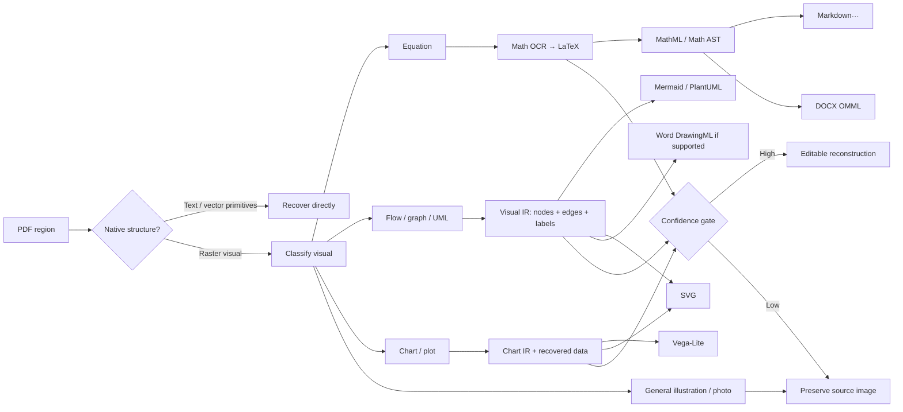
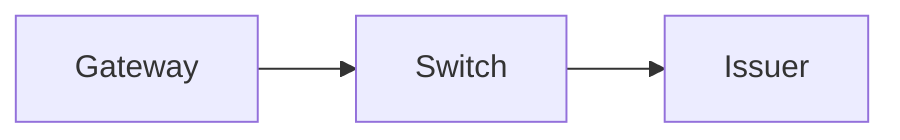

# GlyphMend Upgrade Research: Editable Figures, Mathematical OCR, Native Word Equations, and Apple Liquid Glass

## Executive assessment

GlyphMend already has the right architectural philosophy for this upgrade: **Markdown is the canonical artifact, extraction is local-first, uncertain structure is preserved rather than invented, and DOCX is a downstream representation rather than a second extraction pipeline**. The current browser edition already uses MuPDF WebAssembly, PDF.js, Tesseract.js, Web Workers, IndexedDB, a service worker/PWA, source-visual preservation, and browser-side DOCX generation. It also already converts some simple vector box/connector diagrams to Mermaid and recognized equations to native Word Office Math. fileciteturn19file0L2-L2 fileciteturn20file0L2-L2

My main recommendation is **not** to build a generic “image → Mermaid” feature. Mermaid should be one output of a more general **Visual Reconstruction Pipeline**.

The architecture I would target is:



The core design decision is therefore:

> **Convert visual information into an intermediate semantic representation first, then choose the most appropriate editable output. Do not couple recognition directly to Mermaid, DOCX, SVG, or any single target.**

That gives you a much stronger long-term platform.

| Input type | Canonical editable representation | Markdown representation | DOCX representation | Low-confidence fallback |
|---|---|---|---|---|
| Flowchart / box-and-arrow diagram | Visual graph IR | Mermaid | SVG initially; native DrawingML later | Source image |
| UML / sequence / architecture diagram | Graph IR | Mermaid or PlantUML | SVG; DrawingML subset later | Source image |
| Data chart / plot | Chart IR + recovered data | Vega-Lite fenced block or rendered SVG | SVG; native Office chart only as an advanced phase | Source image |
| Arbitrary vector illustration | SVG scene graph | SVG/image reference | SVG | Source image |
| Photograph / micrograph / artwork | Image | Image | Image | Image |
| Mathematical formula | LaTeX + semantic math AST/MathML | `$...$` / `$$...$$` | Native OMML | Original formula image |
| Unknown visual | Provenance record | Source visual | Source visual | Source image |

Mermaid remains an excellent first-class format for flows because its textual syntax produces editable diagrams and integrates naturally with Markdown. PlantUML expands the representational range, including many UML families, and can now render entirely in-browser through its JavaScript engine. Vega-Lite is materially better than Mermaid for charts because it is a declarative JSON grammar specifically designed around data, visual encodings, transforms, and interactive views. citeturn15search0turn15search1turn15search2

For equations, the clean architecture is:

> **source crop → mathematical OCR → LaTeX → validated semantic math tree → Markdown LaTeX + native Word OMML**

The repository already has the final DOCX mechanism, but its browser-side LaTeX parser currently handles only a narrow subset such as simple fractions, radicals, subscripts, superscripts, and a small symbol map. That should be replaced by a real mathematical intermediate representation rather than expanded indefinitely with regexes. fileciteturn8file0L2-L2

For the UI, there is one important constraint to state plainly: **a browser application cannot literally reproduce Apple’s native Liquid Glass implementation “exactly.”** Apple describes Liquid Glass as a dynamically adaptive system material with real-time lensing, content-aware contrast, illumination, morphing, interaction physics, system accessibility adaptation, and native framework integration. Apple explicitly says standard native controls and toolbars receive the material automatically; SwiftUI is tied directly to those platform capabilities. A CSS implementation can reproduce the hierarchy, geometry, motion philosophy, visual approximation, dark/light behavior, and accessibility policies, but it is not the native optical material. citeturn13search0turn12search2turn12search6

So there are two legitimate targets:

**For the existing PWA:** build an exceptionally faithful **HIG-aligned Liquid Glass web interpretation**.

**For literal Apple fidelity:** eventually provide a SwiftUI iOS/iPadOS/macOS frontend or native chrome around the document engine, because that is where Apple provides the actual system material and interaction behaviors. citeturn12search6turn12search7

As of September 2026, Apple’s current official design resources provide **iOS 27/iPadOS 27 and macOS 27 UI kits in Figma and Sketch**, so those — not screenshots or third-party “Liquid Glass CSS” implementations — should become the source of truth for GlyphMend’s redesign. citeturn24view0

## What GlyphMend already has, and where the real gaps are

The repository is further along than the upgrade description initially suggests.

GlyphMend explicitly defines itself as a local-first, structure-aware reconstruction system where deterministic Markdown is canonical and DOCX is layered on top. The browser implementation requires no backend or document upload. Its semantic contract already contains GitHub/MathJax display equations, conservative OCR equation handling, Mermaid conversion for simple vector box/connector flows, explicit source visuals for raster images, and placeholders for unresolved graphics. The README also defines the trust hierarchy as native structure first, deterministic reconstruction second, readable fallback third, and preserved visual evidence when semantics remain uncertain. fileciteturn19file0L2-L2

That philosophy should **not** change when ML-based visual reconstruction is introduced. In fact, the new capabilities should be made subordinate to it.

The browser implementation currently depends on `mupdf`, `pdfjs-dist`, `tesseract.js`, `@tesseract.js-data/eng`, `docx`, `marked`, `dompurify`, IndexedDB tooling, compression tooling, Vite, PWA tooling, and Vitest. This is already an appropriate foundation for a local document-intelligence application. fileciteturn4file0L2-L2

The browser documentation confirms that structured extraction runs through MuPDF WebAssembly in a worker, retains text blocks, fonts, images, and page geometry, and bundles Tesseract WebAssembly as a local fallback for scanned text. It also explicitly acknowledges that Tesseract is not a dedicated mathematical OCR engine and currently retains equation images rather than inventing LaTeX when recognition is unreliable. fileciteturn20file0L2-L2

### The figure pipeline is already embryonic

The current semantic contract says:

> simple vector box/connector flows → Mermaid

while raster images and ambiguous vector graphics are retained as visual material. fileciteturn19file0L2-L2

That is exactly the right starting boundary. The next upgrade should generalize the existing flow recovery rather than replacing it with a black-box “AI figure converter.”

The distinction between **vector figures** and **raster figures** is especially important. A vector PDF diagram may already contain almost everything needed for reconstruction: text glyph coordinates, rectangles, paths, lines, arrow geometry, colors, and transformations. Rasterizing that page and asking a vision model to rediscover those features would throw away reliable evidence you already possess.

The preferred evidence hierarchy for figures should therefore become:

```text
PDF vectors/text/geometry
        ↓
deterministic structural reconstruction
        ↓
classical local vision
        ↓
small local ML model if useful
        ↓
preserve original image
```

This is consistent with GlyphMend’s existing philosophy and avoids introducing hallucination as a normal extraction behavior. fileciteturn18file0L2-L2

### The equation export path exists, but its parser is the bottleneck

The browser `docx-export.js` already imports native mathematical components from the `docx` library, including `Math`, `MathFraction`, `MathRadical`, `MathSubScript`, `MathSuperScript`, and `MathRun`. Markdown blocks delimited with `$$` are turned into native Word math objects. fileciteturn8file0L2-L2

The weakness is the current `mathComponents()` implementation. It uses pattern matching for:

- a top-level `\frac{...}{...}`;
- a top-level `\sqrt{...}`;
- basic subscript;
- basic superscript;
- a small mapping of Greek letters and relational/operator symbols;
- otherwise a plain `MathRun`.

It then removes braces and converts unknown commands rather bluntly. fileciteturn8file0L2-L2

This means that merely plugging a strong LaTeX OCR model into the current exporter would **not** complete the equation feature. A formula OCR model may correctly produce matrices, nested fractions, sums with limits, integrals, accents, piecewise expressions, aligned equations, operator names, or complex scripts, only for the current DOCX parser to flatten or misrepresent them.

So the equation upgrade has **two separate jobs**:

1. recognize mathematical images correctly;
2. replace the regex-based LaTeX→Word layer with structural math conversion.

Both are required.

### The current UI is not a blank slate either

The present CSS already has deliberate light/dark design tokens, `-apple-system`/SF-style typography, multiple glass-like materials, shadows, radii, blur levels, focus rings, and separate tokens for regular/clear/toolbar/sidebar/capsule treatments. It also tracks system color scheme, reduced motion, reduced transparency, increased contrast, forced colors, coarse pointers, and a mobile-sidebar media condition. fileciteturn10file0L2-L2 fileciteturn14file0L1-L15

So the problem is not “add blur and rounded corners.” The redesign should instead **remove custom interpretations that conflict with Apple’s hierarchy**, reduce unnecessary glass usage, improve adaptive layout, and bring the interaction model closer to the current HIG.

One concrete architectural smell is that a major responsive state currently uses a `max-width: 820px` query, and the stylesheet also has a dedicated 820-pixel breakpoint. fileciteturn15file0L1-L10 fileciteturn15file1L12-L27 Apple’s current guidance increasingly emphasizes layouts that adapt fluidly to available space rather than hard-coding device categories or orientation assumptions; its 2026 SwiftUI/UIKit guidance explicitly recommends adaptive sizing and size-class-like reasoning over fixed device assumptions. citeturn12search2turn12search8

That does not mean “delete all media queries.” It means GlyphMend should make **content requirements determine layout transitions**, rather than treating 820px as “mobile.”

## Making figures genuinely editable

### “Editable” should be defined more precisely

There are actually three different kinds of editability involved:

| Level | Meaning | Example |
|---|---|---|
| Semantic editability | User can edit nodes, edges, labels, values, equations | Mermaid, PlantUML, Vega-Lite, LaTeX |
| Vector editability | Individual visual elements remain vectors but may lack original semantics | SVG |
| Application-native editability | Word sees actual equations, shapes, connectors, or charts | OMML, DrawingML, ChartML |

This distinction matters because **embedding a Mermaid-rendered SVG into Word does not make it a Word-native flowchart**. It remains a graphic. A user can resize or manipulate the SVG as an object, but cannot necessarily click a Mermaid node and edit it as an independent Word shape.

Likewise, SVG is much better than PNG for preservation, but “vector” does not automatically mean “semantic.”

I would therefore establish a product rule:

> GlyphMend should promise **semantic editability in its canonical bundle** and selectively provide native Word editability where reliable.

Trying to make every extracted figure native Word shapes from the beginning would significantly increase OOXML complexity while providing limited additional benefit for many figures.

### Introduce a Visual IR

The strongest architectural upgrade would be an intermediate representation that exists independently of Mermaid.

For example:

```json
{
  "id": "visual-p12-03",
  "page": 12,
  "bbox": [84.2, 312.0, 514.6, 691.2],
  "kind": "flowchart",
  "source": "vector",
  "confidence": 0.94,
  "nodes": [
    {
      "id": "n1",
      "shape": "rounded-rect",
      "text": "Receive request",
      "bbox": [100, 330, 240, 380],
      "confidence": 0.99
    }
  ],
  "edges": [
    {
      "from": "n1",
      "to": "n2",
      "directed": true,
      "label": null,
      "confidence": 0.91
    }
  ]
}
```

Call it something like `VisualIR`, `GlyphGraph`, or `StructuredVisual`.

Then:

```text
PDF geometry ─┐
Raster CV ────┼─→ VisualIR ─→ Mermaid
Local model ──┘             ├→ PlantUML
                            ├→ SVG
                            ├→ DOCX DrawingML
                            └→ accessible text description
```

This separates **recognition** from **serialization**.

That separation becomes extremely valuable later. A better diagram recognizer can replace the old one without changing the Markdown exporter; a new Word-shape exporter can be built without touching extraction; users can edit node labels in a visual editor and regenerate every representation.

### Mermaid should remain the preferred format for graph-like diagrams

Your Mermaid instinct is correct for:

- flowcharts;
- simple process diagrams;
- dependency diagrams;
- basic architecture diagrams;
- state diagrams;
- sequence-like structures when recognizable;
- some entity/relation structures.

Mermaid’s core benefit is not rendering quality alone; it is that a diagram becomes compact, text-editable, diffable, version-controllable source rather than an opaque binary. Its current ecosystem covers multiple graph and software-diagram types. citeturn15search0

Recent research directly validates this direction. **Flowchart2Mermaid**, published as a 2025 preprint, demonstrates a VLM-powered flowchart-image-to-Mermaid system and explicitly targets editable, version-controllable textual representations. citeturn22academia0

However, that research also illustrates why Mermaid should be the **output**, not your recognition architecture. Image-to-code systems still need quality evaluation because visual models can omit or invent topology. A 2026 preprint proposed production-time evaluation based on OCR recall plus visual entailment precisely because arbitrary image-to-Mermaid generation lacks ground truth at inference time. citeturn22academia1

Another 2026 preprint, EdgeFlow, found that augmenting a VLM with deterministically extracted edge maps materially improved flowchart topology on its industrial requirements dataset, although the improvement did not generalize equally across every benchmark. That is good evidence for the hybrid strategy I recommend: **deterministic geometry first, ML interpretation second**. citeturn22academia2

### Add PlantUML selectively, not as a replacement

PlantUML is useful when the figure is clearly UML-like and Mermaid cannot faithfully represent its semantics. PlantUML supports a wider family of software/system diagrams and an official JavaScript rendering engine can run entirely in the browser using TeaVM/Viz.js, so introducing it does not inherently violate the local/offline architecture. citeturn15search1

I would not expose “Mermaid vs PlantUML” as a normal end-user decision during import.

Instead:

```text
flow/process/basic graph     → Mermaid
sequence/state/class simple  → Mermaid if expressive enough
complex UML                  → PlantUML
unknown/freeform             → SVG/image
```

Users could change the representation later.

### Charts need a different language

A scientific chart is fundamentally different from a graph diagram.

Consider a bar chart. The meaningful information is:

```text
data table
+ x/y mappings
+ mark type
+ scales
+ labels
+ legend
+ transformations
```

It is not fundamentally a set of arbitrary boxes and arrows.

Vega-Lite is built exactly around this representation. It provides concise declarative JSON specifications for visualizations and supports interactive multi-view graphics in the browser. citeturn15search2

So a future chart pipeline should be:

```text
chart image/vector
   ↓
detect axes, marks, legend, labels
   ↓
recover values/data where confidence permits
   ↓
ChartIR
   ↓
Vega-Lite + source data table
```

For example, an extracted figure could be represented in a GlyphMend Markdown extension:

````markdown
```vega-lite
{
  "data": {
    "values": [
      {"year": 2024, "revenue": 12.4},
      {"year": 2025, "revenue": 14.1}
    ]
  },
  "mark": "bar",
  "encoding": {
    "x": {"field": "year", "type": "ordinal"},
    "y": {"field": "revenue", "type": "quantitative"}
  }
}
```
````

The standard Markdown export could optionally render that to SVG when the destination does not understand the extension.

But chart reconstruction needs a **much stricter confidence threshold** than a flowchart. Mistaking a line connection in a diagram is undesirable; silently changing a plotted value from 1.2 to 1.7 can change the scientific claim.

I would therefore initially support:

> native/vector chart → editable when data recovery is deterministic; raster chart → preserved image plus optional candidate reconstruction requiring review.

### SVG is the universal structural fallback

Some figures simply do not map well to Mermaid or Vega-Lite: circuit-like illustrations, heavily positioned architecture diagrams, annotated scientific schematics, timelines with unusual geometry, or composite figures.

For those, SVG is a much better fallback than rasterizing to PNG.

The hierarchy should be:

```text
semantic editable format available?
    yes → Mermaid / PlantUML / Vega-Lite
    no
        vector source recoverable?
            yes → SVG
            no → PNG/JPEG source crop
```

This also improves DOCX visual quality because an SVG can remain sharp under scaling even when the semantic diagram source is stored separately.

### Raster flowchart reconstruction can remain completely local

For simple raster diagrams, you do not necessarily need a VLM.

OpenCV.js provides browser-side computer-vision functions through WebAssembly. citeturn17search0 Combined with the Tesseract infrastructure GlyphMend already has, you can build a deterministic first pass:

```text
crop
 ↓
grayscale / threshold
 ↓
contour detection
 ↓
rectangle / ellipse detection
 ↓
line detection
 ↓
arrowhead detection
 ↓
OCR text inside shapes
 ↓
associate connectors with nearest ports/shapes
 ↓
graph reconstruction
 ↓
VisualIR
 ↓
Mermaid
```

This will not solve every diagram, but it should be fast, inspectable, offline, and very good on clean publication-quality flowcharts.

A small local model can then be the **fallback**, not the first mechanism.

Browser-side ML is technically viable without introducing a backend. ONNX Runtime Web explicitly supports local browser inference, offline operation, WebAssembly CPU execution, and WebGPU/WebNN/WebGL acceleration depending on browser/device support. The documentation also cautions that browser models must be small enough for client hardware, and not every operator is supported by every accelerated backend. citeturn19view0

This architecture fits GlyphMend very naturally:

```text
visual-worker.js

vector recoverer
      ↓
OpenCV deterministic recognizer
      ↓
optional ONNX recognizer
      ↓
Visual IR
      ↓
confidence / validation
```

### Word export should have two levels

For the first implementation, I recommend:

**Mermaid / PlantUML / Vega-Lite → SVG → DOCX**

and put the editable source in the complete GlyphMend export bundle.

Later, for common flowcharts, implement:

**VisualIR → Word DrawingML shapes/connectors**

That later exporter could support a deliberately limited subset:

- rectangles;
- rounded rectangles;
- diamonds;
- ellipses;
- text boxes;
- straight/elbow connectors;
- arrows;
- grouped shapes.

If a graph can be represented inside that subset, the DOCX becomes genuinely editable as Word shapes.

If not, insert the SVG.

This avoids the dangerous promise that every PDF illustration can somehow become a clean set of Word drawing objects.

## Turning equation images into real mathematics

This is the area where I believe GlyphMend can make its most valuable near-term improvement.

### Keep LaTeX as the Markdown representation

GlyphMend already uses `$$ ... $$` for display equations and conservative LaTeX reconstruction. That is the correct canonical Markdown representation and should remain unchanged. fileciteturn19file0L2-L2

For example:

```markdown
The posterior distribution is

$$
p(\theta \mid x)
=
\frac{p(x \mid \theta)\,p(\theta)}
{\int p(x \mid \theta')\,p(\theta')\,d\theta'}
$$
```

For inline equations:

```markdown
The value of $x_i$ is normalized before estimation.
```

There is no reason to invent a GlyphMend-specific equation language.

What should change is **how the LaTeX is obtained and validated**.

### A dedicated math recognizer is necessary

Tesseract is useful for normal OCR but is not designed to reconstruct two-dimensional mathematical structure; GlyphMend’s own browser documentation already recognizes this limitation. fileciteturn20file0L2-L2

Several dedicated mathematical-expression-recognition families are relevant.

| Candidate | Strength | Browser/local suitability | Important issue |
|---|---|---|---|
| Texo | Very small dedicated formula model | Excellent technical fit | AGPL-3.0 repository license |
| UniMERNet | Strong real-world formula recognition | Heavier; possible ONNX work required | Browser performance needs benchmarking |
| PP-FormulaNet | Accuracy/efficiency variants | Promising | Need deployment/licensing validation |
| pix2tex / LaTeX-OCR | Mature image→LaTeX approach | Better suited to Python/desktop baseline | Less attractive as current browser default |

Texo is especially interesting technically. Its 2026 paper describes a **20-million-parameter** mathematical recognition model designed for in-browser deployment, reporting performance comparable with substantially larger models such as UniMERNet-T and PPFormulaNet-S. citeturn16search1

However, the current Texo repository declares **AGPL-3.0**. fileciteturn16file0L1-L13 That does not make it unusable — GlyphMend already has to address AGPL/commercial licensing for MuPDF.js — but it means this dependency should be chosen deliberately rather than added casually. GlyphMend’s own browser documentation identifies MuPDF.js as AGPL-3.0-or-later or commercially licensed. fileciteturn20file0L2-L2

UniMERNet is another serious candidate. Its paper specifically targets **real-world mathematical expression recognition**, introducing the large UniMER-1M dataset and a network designed for complex real-world expressions. citeturn16academia11 Its GitHub repository currently reports an Apache-2.0 code license. fileciteturn17file0L1-L13

That does **not** automatically settle model-weight or training-data licensing; those should be audited independently before shipping.

PP-FormulaNet is also worth benchmarking. The 2025 paper offers separate accuracy-oriented and efficiency-oriented models and reports gains over earlier mathematical-recognition approaches. citeturn16academia14

My recommendation is therefore not “pick model X today.” It is:

> Build the equation-recognition interface around ONNX/local inference, then benchmark at least Texo and a legally suitable UniMERNet/PP-FormulaNet variant against a GlyphMend-specific formula corpus.

That prevents the application architecture from becoming dependent on one research model.

### The equation pipeline should be confidence-gated

I would implement the following:

```text
source equation crop
      ↓
image preprocessing
      ↓
math OCR model
      ↓
LaTeX candidate
      ↓
parse
      ↓
render candidate back to image
      ↓
compare rendering against source crop
      ↓
combined confidence
      ↓
high confidence → editable equation
low confidence  → source image + suggested equation
```

Preprocessing can include:

- tight crop;
- deskew;
- foreground/background normalization;
- resolution normalization;
- margin normalization;
- noise removal where necessary.

The critical improvement is the **render-back validation**.

Suppose the recognizer returns:

```latex
\frac{1}{n}\sum_{i=1}^{n}x_i
```

Render that locally and compare its visual structure against the original equation crop.

This is much stronger than trusting the model’s token probability alone.

The approach has academic support. LATTE, a 2024 preprint on LaTeX recognition, uses differences between the expected image and the rendered extracted LaTeX as feedback for locating and refining recognition errors. citeturn16academia12 I would not necessarily reproduce LATTE’s full model architecture, but its **render-and-compare principle** is particularly well suited to GlyphMend’s conservative quality philosophy.

A confidence score could combine:

```text
recognizer sequence confidence
+ LaTeX parse success
+ rendered-image similarity
+ source-image quality
+ geometry agreement
```

Do not collapse this to one unexplained number internally. Persist the components so failures can be diagnosed.

### Preserve the original equation even after successful recognition

This is important.

Even when GlyphMend converts:

```text
equation-004.png
```

into:

```latex
\int_0^\infty e^{-x}\,dx = 1
```

keep the original crop in the workspace/export bundle.

A manifest could contain:

```json
{
  "id": "eq-p08-04",
  "kind": "equation",
  "page": 8,
  "bbox": [121.4, 422.8, 491.1, 487.2],
  "sourceAsset": "assets/eq-p08-04.png",
  "latex": "\\int_0^\\infty e^{-x}\\,dx = 1",
  "recognizer": {
    "model": "...",
    "version": "...",
    "runtime": "onnx",
    "confidence": 0.973
  },
  "validation": {
    "parse": true,
    "visualSimilarity": 0.961
  },
  "status": "accepted"
}
```

That gives you:

- undo;
- reprocessing with future models;
- visual auditing;
- reproducible extraction;
- human verification;
- protection against silent model regressions.

This is a natural extension of GlyphMend’s existing checkpoint/manifest philosophy. The current workspace manifest already records source/configuration fingerprints, algorithm versions, part metadata, checksums, and output metadata. fileciteturn18file0L2-L2

### Use a semantic math representation between LaTeX and Word

The most important engineering recommendation in the equation work is:

> **Do not map raw LaTeX directly to DOCX with regex.**

Introduce:

```text
LaTeX
  ↓
MathML or internal Math AST
  ↓
 ├─ HTML/browser renderer
 └─ OMML generator
```

Temml is one attractive component because it is specifically a JavaScript TeX→MathML converter, works browser-side or server-side, has broad LaTeX coverage, and is MIT-licensed. citeturn20search1

MathJax is another option. Current MathJax 4 supports LaTeX and MathML in modern browsers and includes accessibility capabilities such as assistive-technology support, speech generation, and expression exploration. citeturn20search0

You probably do not need both in the core bundle.

For GlyphMend I would evaluate:

```text
LaTeX
 ↓
Temml
 ↓
MathML DOM
 ↓
GlyphMend Math AST
 ↓
OMML
```

because it gives you a relatively small semantic conversion layer.

Your internal AST might look like:

```ts
type MathNode =
  | { type: "row"; children: MathNode[] }
  | { type: "identifier"; value: string }
  | { type: "number"; value: string }
  | { type: "operator"; value: string }
  | { type: "fraction"; numerator: MathNode; denominator: MathNode }
  | { type: "sqrt"; body: MathNode }
  | { type: "root"; body: MathNode; index: MathNode }
  | { type: "sub"; base: MathNode; sub: MathNode }
  | { type: "sup"; base: MathNode; sup: MathNode }
  | { type: "subsup"; base: MathNode; sub: MathNode; sup: MathNode }
  | { type: "fenced"; open: string; close: string; body: MathNode }
  | { type: "matrix"; rows: MathNode[][] }
  | { type: "nary"; op: string; lower?: MathNode; upper?: MathNode; body?: MathNode }
  | { type: "accent"; accent: string; body: MathNode };
```

Then your Word exporter maps semantic nodes to Word Math.

This is more work initially, but it prevents an endless sequence of increasingly fragile regular expressions.

### Expand Word-native math intentionally

The existing `docx` dependency works in the browser and exposes a declarative `.docx` API. citeturn20search2 GlyphMend is already using its Math classes. fileciteturn8file0L2-L2

The first complete semantic subset I would support is:

| Mathematical construct | Priority |
|---|---:|
| Variables, numbers, operators | Essential |
| Greek and mathematical symbols | Essential |
| Fractions | Essential |
| Superscripts/subscripts | Essential |
| Combined subscript + superscript | Essential |
| Square roots and indexed roots | Essential |
| Parentheses/brackets/braces | Essential |
| Integrals | Essential |
| Summations/products with limits | Essential |
| Functions such as `sin`, `log`, `lim` | Essential |
| Matrices | High |
| Piecewise/cases | High |
| Accents, bars, vectors, hats | High |
| Aligned equations | High |
| Text inside math | High |
| Advanced macro packages | Fallback |

Unsupported expressions should never silently become approximate plain text.

Use:

```text
native OMML supported?
  yes → native Word equation
  no  → rendered equation + original LaTeX preserved in bundle
```

The DOCX test suite should then validate the generated OOXML structurally, not only check that a DOCX file opens.

### Equation UX should expose uncertainty

For a recognized equation, the editor could show:

```text
┌───────────────────────────────────────────────┐
│  Equation                             ✓ 97%   │
│                                               │
│       ∂L             ∂L                       │
│      ──── = ... + λ ───                       │
│       ∂θ             ∂θ                       │
│                                               │
│  LaTeX                                        │
│  \frac{\partial L}{\partial\theta}=...        │
│                                               │
│  [View source crop]  [Edit]  [Revert image]   │
└───────────────────────────────────────────────┘
```

For low confidence:

```text
Equation candidate — review required
```

rather than silently substituting the formula.

That fits the existing product principle much better than treating ML output as extraction truth.

## Redesigning GlyphMend around current Apple Liquid Glass

### Start from Apple’s current resources, not Liquid Glass imitation libraries

Apple’s design-resource page currently publishes official **iOS 27/iPadOS 27 and macOS 27 UI kits** in Figma and Sketch, together with the current SF family and SF Symbols resources. citeturn24view0

Those should become the design reference for:

- geometry;
- spacing;
- hierarchy;
- toolbar composition;
- control proportions;
- typography;
- icon treatment;
- sidebar structure;
- sheets;
- navigation behavior;
- dark appearance.

Do not start by tuning `backdrop-filter`.

Liquid Glass is a **design hierarchy before it is a blur effect**.

Apple explains that Liquid Glass forms a distinct functional layer of controls and navigation floating above the content layer. The company explicitly advises against applying glass to the content layer and against glass-on-glass stacking. Apple defines two variants, Regular and Clear; Regular is the general-purpose adaptive material, while Clear is intentionally more transparent and requires appropriate media-rich backgrounds and dimming to retain legibility. citeturn13search0

That gives GlyphMend a very clear redesign rule:

```text
PDF / Markdown / Preview = CONTENT
Toolbars / navigation / transient controls = GLASS
```

Not:

```text
every card
every sidebar section
every setting group
every panel
every button
= glass
```

### The current custom material system should be simplified

GlyphMend currently defines separate custom CSS materials for regular glass, clear glass, toolbar glass, sidebar glass, capsule glass, regular strong variants, numerous borders, shadows, highlight values, and blur levels in both light and dark appearances. fileciteturn10file0L2-L2

That demonstrates thoughtful work, but I would reduce the vocabulary considerably.

A more HIG-aligned web implementation should effectively have:

```text
content/background
content/elevated
glass/regular
glass/clear
glass/selected-overlay
```

with component-specific geometry but not a different simulated material for every component.

The design rule becomes:

> **One coherent glass control plane over an ordinary content plane.**

This is closer to Apple’s own explanation of Liquid Glass as a singular floating functional/navigation layer. citeturn13search0

### Do not attempt to imitate native lensing with excessive CSS effects

Apple’s actual Liquid Glass dynamically changes shadowing, tint, brightness, contrast, light/dark behavior, refraction, and interaction response according to underlying content and material size. It can flex and morph, dynamically increase separation when text moves underneath, and respond physically to interaction. citeturn13search0

A combination such as:

```css
background: rgba(...);
backdrop-filter: blur(...);
box-shadow: ...;
```

can look similar in a still screenshot, but cannot reproduce the whole native system.

The better objective for GlyphMend Web is:

> **Follow Apple’s structural rules exactly; approximate the optical material carefully.**

That is a more defensible standard than claiming exact native Liquid Glass in a browser.

Apple’s 2026 SwiftUI guidance reinforces the distinction: standard/native toolbar and navigation controls receive the right Liquid Glass treatment automatically, and Apple explicitly recommends native `glassButtonStyle` rather than simply applying a generic glass effect to a button. citeturn12search2

### A mobile-first GlyphMend should not expose the desktop workspace shrunk down

The mobile version should be designed as a separate composition of the same functions.

I recommend four top-level document modes:

```text
Source     Markdown     Preview     Review
```

On an iPhone-sized viewport, show one mode at a time.

The default work area becomes:

```text
┌──────────────────────────┐
│ ‹ Files      Document  ⋯ │  ← floating/navigation chrome
├──────────────────────────┤
│                          │
│                          │
│      CONTENT CANVAS      │
│                          │
│                          │
│                          │
├──────────────────────────┤
│ Source  Edit  Preview ●  │  ← bottom glass navigation
└──────────────────────────┘
```

Apple’s current HIG describes tab bars as floating above content at the bottom of the screen on relevant platforms, using Liquid Glass as the navigation surface. citeturn11search4

Actions such as extraction settings, export, quality report, OCR language, and recognition settings should move into sheets/popovers rather than permanently occupying lateral inspectors on narrow screens.

The PDF page itself, Markdown itself, and rendered document preview remain visually calm content surfaces.

### Layout should progressively expand instead of switching between “mobile” and “desktop”

A useful responsive model is:

| Available width | Workspace composition |
|---|---|
| Compact | Single pane + bottom navigation |
| Medium | Main pane + optional secondary pane |
| Wide | Source + editor/preview |
| Extra wide | Source + editor/preview + inspector/review |

Do not identify these states with specific products such as “iPhone” or “iPad.” Determine them from **usable space**.

Apple’s 2026 guidance explicitly warns against hard-coding specific device/window sizes and recommends fluid adaptation to the available environment; iOS 27 also extends resizability, making fixed idiom/orientation assumptions increasingly inappropriate. citeturn12search2turn12search8

On the web, the equivalent architecture is:

- CSS Grid;
- container queries where practical;
- intrinsic sizing;
- `minmax()`;
- dynamic viewport units;
- coarse-pointer adaptations;
- safe-area insets;
- no dependence on orientation strings.

GlyphMend already has some responsive and coarse-pointer awareness, but moving from a major 820-pixel “mobile” threshold toward container-driven layout would make the UI materially more resilient. fileciteturn12file0L1-L10 fileciteturn15file1L12-L27

### Search and document actions should move with ergonomics

Apple’s current design language increasingly distinguishes where controls live according to available space and device ergonomics rather than forcing identical toolbar layouts everywhere. Toolbars and navigation structures have also received explicit Liquid Glass guidance. citeturn11search10turn12search8

For GlyphMend, that suggests:

**Compact layout**

```text
bottom:
  search
  previous/next result
  page / outline
  mode switching

top:
  back
  title
  primary menu
```

**Wide layout**

```text
top:
  document title
  search
  extraction / export actions

side:
  document outline / page thumbnails
```

A persistent desktop-like header full of icons should not simply shrink on phones.

### Dark and light mode should be semantic, not separate designs

Apple describes Liquid Glass as inherently adaptive rather than a fixed light material or fixed dark material. citeturn13search0

GlyphMend’s existing token system already has separate light/dark semantic values and listens to `prefers-color-scheme`. fileciteturn10file0L2-L2 fileciteturn14file0L1-L15

Keep that approach, but make components consume semantic roles rather than raw appearance-specific colors:

```css
--content-bg
--content-elevated
--label-primary
--label-secondary
--separator
--accent
--glass-fill
--glass-edge
--glass-highlight
--glass-shadow
```

Then appearance modes change the tokens rather than introducing separate component behavior.

### Accessibility needs to control the material, not merely the content

Apple’s Liquid Glass design explicitly adapts to:

- Reduced Transparency;
- Increased Contrast;
- Reduced Motion.

Reduced Transparency makes the material more obscuring/frosted; Increased Contrast moves the material toward stronger black/white separation with contrasting borders; Reduced Motion lowers animation intensity and disables elastic behavior. citeturn13search0

GlyphMend already queries the corresponding web preferences, including reduced transparency, increased contrast, reduced motion, and forced colors. fileciteturn14file0L1-L15

That is a strength worth keeping.

The redesign should ensure these preferences change **the glass material itself**, not just disable an unrelated animation.

For example:

```css
@media (prefers-reduced-transparency: reduce) {
  /* use substantially more opaque navigation material */
}

@media (prefers-reduced-motion: reduce) {
  /* remove elastic morphing and scale transitions */
}

@media (prefers-contrast: more) {
  /* strengthen boundaries and foreground contrast */
}
```

Also expose equivalent GlyphMend appearance controls inside Settings so users can override where browsers or operating systems do not propagate every preference consistently.

### Apple’s 2026 refinement makes restraint even more important

Liquid Glass is not frozen at its 2025 introduction. Apple’s 2026 material says the design continues to evolve, including refinements to diffusion over complex backgrounds, consistency, interaction, and adaptive/resizable layouts. citeturn12search3turn12search7

This is another reason not to encode dozens of handcrafted glass recipes.

The less GlyphMend hard-codes pseudo-optical behavior, the easier it will be to follow Apple’s evolving design language.

### Literal Apple fidelity needs a native presentation layer

This is the one place where I would challenge the requirement as written.

If the requirement is:

> “It should be visually faithful to Apple’s current HIG while remaining a browser PWA.”

That is achievable.

If the requirement is:

> “It must use exactly the same Liquid Glass behavior and material that native Apple apps use.”

That is not realistically achievable inside ordinary webpage CSS. This is an inference from Apple’s own documentation: the material’s behaviors come through SwiftUI/UIKit/AppKit system implementations and standard controls, and Apple explicitly emphasizes that SwiftUI receives platform design capabilities natively. citeturn12search6turn12search9

For that higher bar, I would eventually structure the product as:

```text
                    GlyphMend Core
            extraction / VisualIR / MathIR
                  /               \
                 /                 \
        Browser/PWA           Native Apple UI
        HTML/CSS/JS           SwiftUI
        cross-platform        iOS/iPadOS/macOS
```

The PWA remains the universal local version.

The native Apple app receives true system Liquid Glass, native toolbars, native sheets, native menus, native document interactions, native accessibility behavior, and future OS appearance updates automatically. Apple specifically notes that native apps receive many Liquid Glass refinements automatically with current frameworks. citeturn12search1turn12search3

## Recommended target architecture and implementation sequence

The cleanest implementation is not three unrelated features called “Mermaid,” “equation OCR,” and “Liquid Glass.” It is an upgrade of GlyphMend into a **structured document reconstruction engine with typed semantic assets**.

### Canonical document model

I would keep Markdown canonical for textual interoperability, but add a structured asset layer beside it:

```text
document.md

assets/
  visual-p004-01.png
  visual-p004-01.svg
  diagram-p007-02.mmd
  chart-p011-01.vl.json
  equation-p018-03.png

manifest.json
```

Then Markdown can remain readable:

````markdown
## Architecture



The expected loss is

$$
L(\theta)
=
-\sum_{i=1}^{n} y_i \log p_\theta(y_i \mid x_i)
$$
````

while `manifest.json` retains provenance, confidence, source bounding boxes, source images, model version, reconstruction status, and relationships between editable representations.

This also avoids stuffing GlyphMend-specific metadata into visible Markdown.

### Add a common recognition contract

Something like:

```ts
interface ReconstructedAsset {
  id: string;
  kind:
    | "equation"
    | "flowchart"
    | "diagram"
    | "chart"
    | "illustration"
    | "photo"
    | "unknown";

  page: number;
  bbox: [number, number, number, number];

  source: {
    type: "vector" | "raster" | "mixed";
    assetId?: string;
  };

  reconstruction?: {
    format:
      | "latex"
      | "mermaid"
      | "plantuml"
      | "vega-lite"
      | "svg";
    source: string;
  };

  confidence: {
    overall: number;
    components: Record<string, number>;
  };

  disposition:
    | "accepted"
    | "review"
    | "preserved";
}
```

That would make the pipeline extensible without tying extraction to rendering.

### Move heavy recognition to dedicated workers

The existing architecture already isolates extraction in workers. fileciteturn20file0L2-L2

Continue that model:

```text
extract-worker.js
    PDF structure

ocr-worker.js
    prose OCR

math-worker.js
    equation OCR + validation

visual-worker.js
    OpenCV / diagram reconstruction / chart classification
```

ONNX Runtime Web is particularly appropriate here because browser inference can run locally/offline and select GPU or CPU execution according to device capability. citeturn19view0

Do not perform model inference on the UI thread.

### Treat model packs as optional capabilities

Adding mathematical and visual ML models could turn a lightweight offline PWA into a large download.

I would therefore split installation into:

```text
GlyphMend Core
  ✓ PDF extraction
  ✓ normal OCR
  ✓ Markdown
  ✓ DOCX
  ✓ deterministic vectors
  ✓ source visuals

Equation Recognition Pack
  optional local model

Advanced Visual Recognition Pack
  optional local model
```

The user could see:

> Equation Recognition · 48 MB · Installed

rather than unknowingly downloading models on first launch.

After download, the model can be cached locally and used offline.

ONNX Runtime’s own browser documentation explicitly notes both the offline/privacy advantages of client inference and the need to keep models sufficiently small for client hardware. citeturn19view0

This is especially important for a mobile-first product.

### Recommended implementation order

| Stage | Deliverable | Why I would do it in this order |
|---|---|---|
| Foundation | Asset manifest + VisualIR + Math AST + review status | Prevents later features from becoming format-specific hacks |
| Equation pipeline | Dedicated math OCR, LaTeX validation, source preservation | Clear user value; existing DOCX pathway already exists |
| Native Word math | MathML/AST → comprehensive OMML | Completes equation promise end-to-end |
| Vector diagram upgrade | PDF vector primitives → VisualIR → Mermaid | Leverages highest-quality evidence first |
| Raster flowcharts | OpenCV.js + OCR → VisualIR → Mermaid | Remains local, explainable, relatively lightweight |
| Visual model fallback | Optional ONNX diagram recognizer | Handles difficult cases without controlling core extraction |
| Chart reconstruction | ChartIR + Vega-Lite | More difficult; higher semantic risk |
| Native Word diagrams | VisualIR → DrawingML subset | Valuable but not required for first semantic editability |
| UI redesign | Mobile-first HIG hierarchy + current UI Kit | Can proceed in parallel once workspace behavior is stable |

I would **not** begin with image→Mermaid AI.

I would begin with the intermediate representations and equation pipeline because those provide the architecture every later feature needs.

### Export formats should become explicit products

I would evolve “Complete bundle” into a genuine round-trip archival format:

```text
report.glyphmend.zip

  document.md
  document.docx

  assets/
    originals/
    rendered/
    reconstructed/

  diagrams/
    *.mmd
    *.puml

  charts/
    *.vl.json
    *.csv

  equations/
    *.tex
    *.mathml

  manifest.json
  quality-report.json
```

A normal user can still press:

> Export → Word

Researchers and advanced users can choose:

> Export → Reconstructable Bundle

This makes GlyphMend considerably more valuable than a conventional PDF converter.

## Product, quality, privacy, and engineering improvements

### Build a dedicated Review Queue

The most important additional product feature I would add is not another extractor.

It is:

> **Review reconstructed content**

The queue could contain:

```text
Review
  3 equations
  2 figures
  1 table
  4 OCR regions
```

Each item shows:

```text
Original | Reconstructed
```

and allows:

```text
Accept
Edit
Keep original
```

This turns uncertainty into a manageable workflow instead of hidden extraction risk.

It would also make GlyphMend substantially more credible for academic, legal, financial, and technical documents where “looks plausible” is not sufficient.

### Make confidence explainable

Avoid:

> Confidence: 87%

with no explanation.

Instead:

```text
Equation confidence       92%
Recognition model         96%
Syntax validity          valid
Visual agreement          89%
Crop quality              93%
```

or for a diagram:

```text
Diagram confidence        78%
Labels recovered          100%
Nodes                     94%
Connector topology        69%
Review recommended
```

Recent image-to-flowchart research itself emphasizes that structural accuracy, flow correctness, syntax validity, and completeness need separate evaluation rather than a single superficial success measure. citeturn22academia0turn22academia1

### Build a benchmark corpus before choosing the ML models

The wrong process would be:

```text
model has impressive README
→ add dependency
```

Instead create a GlyphMend corpus with document classes such as:

```text
equations/
  simple
  matrices
  integrals
  aligned equations
  noisy scans
  low-resolution scans
  colored backgrounds
  mixed prose + equation

figures/
  clean flowcharts
  UML
  architecture
  scientific diagrams
  raster charts
  vector charts
  photos
  ambiguous composites
```

Then measure:

**Equations**

```text
normalized LaTeX exact match
rendered visual similarity
structural tree similarity
manual semantic correctness
DOCX native equation validity
```

**Diagrams**

```text
node precision/recall
edge precision/recall
label OCR accuracy
direction accuracy
syntax validity
render similarity
```

A visually similar Mermaid diagram with a reversed arrow is not faithful.

### Version every reconstruction

Persist:

```text
glyphmend extraction version
recognizer family
model identifier
model hash
tokenizer version
runtime
preprocessing version
confidence rules version
```

Then if the model changes, you can tell whether a result came from:

```text
math-recognition-v1
```

or:

```text
math-recognition-v3
```

This matters for reproducibility and regression analysis.

It also aligns nicely with the repository’s existing checkpoint philosophy, which already validates source fingerprints, configurations, extraction algorithm versions, and persisted checksums. fileciteturn18file0L2-L2

### Preserve determinism as a first-class mode

I would expose two conceptual extraction levels:

```text
Faithful
```

Uses only native evidence and deterministic algorithms.

```text
Enhanced Reconstruction
```

Adds local learned visual/equation recognition.

Both remain offline.

That distinction is useful because some users will actively prefer “do not infer anything using a neural model.”

The canonical output could record which mode generated each reconstructed asset.

### Do not let models turn conservative extraction into generative reconstruction

The most valuable line in the GlyphMend architecture is effectively:

> preserve uncertain structure instead of inventing it. fileciteturn18file0L2-L2

Keep it.

That means:

```text
model output ≠ truth
```

A local VLM that confidently interprets a fuzzy arrow is still making an inference.

For content extraction, false positives are generally more dangerous than unresolved content.

Your replacement rule should be asymmetric:

```text
very strong evidence → convert
medium evidence      → suggest/review
weak evidence        → retain source
```

### Security becomes more important once diagrams are executable markup

Mermaid, PlantUML, SVG, HTML previews, and model-generated markup introduce a larger parsing surface than plain source images.

Keep the current DOM sanitization boundary and treat reconstructed content as hostile input even though it originated from the user’s own PDF. GlyphMend already uses DOMPurify in the browser dependency set. fileciteturn4file0L2-L2

In particular:

```text
never execute extracted HTML
never trust SVG script/content
never permit diagram labels to inject arbitrary HTML
sanitize rendered markup
use restrictive Mermaid configuration
keep Content Security Policy strict
do not dynamically load arbitrary model/code URLs from documents
```

The current repository already explicitly states that it does not intentionally execute PDF JavaScript, attachments, links, or embedded files as application code. fileciteturn18file0L2-L2 The enhanced visual pipeline should maintain that boundary.

### Licensing needs to become part of dependency acceptance

You already have a meaningful licensing constraint: the browser documentation notes MuPDF.js’s AGPL/commercial licensing. fileciteturn20file0L2-L2

Adding ML makes the matrix more complicated:

```text
runtime license
model code license
model weights license
training dataset restrictions
font license
diagram renderer license
```

Texo is technically attractive but currently identifies as AGPL-3.0. fileciteturn16file0L1-L13 UniMERNet’s repository identifies as Apache-2.0, but that alone is not enough to conclude that every model artifact and dataset can be redistributed under the same terms. fileciteturn17file0L1-L13

I would add a required dependency record such as:

```text
Dependency
Purpose
Code license
Model-weight license
Training-data terms reviewed?
Browser redistribution allowed?
Commercial use reviewed?
Source-disclosure implications?
```

before any recognizer becomes bundled production functionality.

### Accessibility can become a genuine competitive advantage

For reconstructed mathematics, provide semantic MathML in the rendered web view when possible. MathJax 4 specifically supports assistive technologies, speech generation, and mathematical expression exploration. citeturn20search0

For reconstructed diagrams, the Visual IR can automatically produce an accessible textual representation:

> “Flowchart with five nodes. ‘Upload PDF’ leads to ‘Extract structure’. ‘Extract structure’ branches to ‘Successful’ and ‘Review required’…”

This is far better than an image with:

```html
alt="figure"
```

The generated description should remain user-editable.

### Performance should be budgeted per capability

Do not send every figure through every recognizer.

Use a cascade:

```text
native evidence?
  yes → deterministic

obviously photo?
  yes → preserve

equation candidate?
  yes → math model only

simple flowchart candidate?
  yes → OpenCV + OCR

complex diagram?
  optional local model

chart?
  chart-specific pipeline

unknown?
  preserve
```

This matters particularly on phones, where model initialization, memory pressure, thermal throttling, and battery use are product concerns even when inference technically works.

ONNX Runtime itself recommends choosing models appropriate to client hardware and provides model/runtime optimization mechanisms because web memory and processing budgets are finite. citeturn19view0

### The strongest long-term product positioning is broader than “PDF to Markdown”

After these upgrades, I would think about GlyphMend internally as:

> **a local-first, evidence-preserving document reconstruction environment**

rather than merely a PDF-to-Markdown utility.

The differentiator becomes:

```text
PDF
 ↓
structured, inspectable document
 ↓
text remains text
tables remain tables
math becomes math
flows become graphs
charts become data-backed visuals when recoverable
unrecoverable visuals remain source evidence
 ↓
Markdown / Word / structured bundle
```

That is substantially more coherent than competing on raw OCR alone.

The most defensible product principle would be:

> **Everything that can be reconstructed faithfully becomes editable. Everything that cannot be reconstructed faithfully remains visibly tied to the source.**

That principle already exists implicitly in GlyphMend’s current trust hierarchy; the upgrade should make it the organizing idea across text, math, figures, UI, quality reporting, and export. fileciteturn19file0L2-L2

My technical priority would therefore be **VisualIR + MathIR first, equation-image recognition second, robust OMML third, vector/raster flowchart reconstruction fourth, and chart reconstruction after that**. The Apple redesign should proceed as a parallel UI track, but with an important change in interpretation: use Apple’s current iOS/iPadOS 27 and macOS 27 kits and Liquid Glass hierarchy as the authoritative design specification, while describing the browser result honestly as a HIG-faithful web implementation rather than claiming it is the native Apple material. citeturn24view0turn13search0
